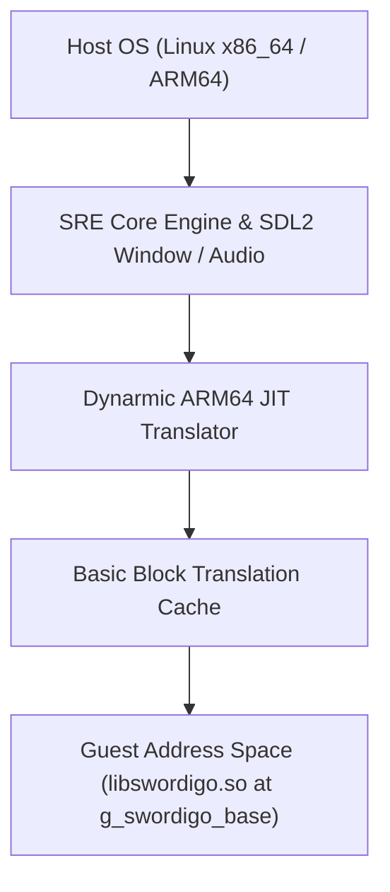

# SRE PC Port Trampoline & Dynarmic JIT Hook Integration Requirements

> **Document Path**: `docs/inline-trampline-for-sre/02_sre_pc_port_trampoline_and_jit_hook_requirements.md`
> **Target Environment**: SRE (Swordigo Runtime Engine) / Dynarmic ARM64 JIT Emulation Layer
> **Platform**: Linux x86_64 / ARM64 Host

---

## 1. Architectural Overview of SRE JIT Emulation

In the SRE PC Port architecture, Swordigo's native Android ARM64 binary (`libswordigo.so`) is executed via **Dynarmic JIT Emulation**.



When native inline hooking mechanisms (like GlossHook or SRE Trampolines) modify guest opcodes in `GuestRAM`, the Dynarmic JIT engine does not automatically re-translate modified guest instructions unless **JIT Cache Invalidation** is explicitly triggered.

---

## 2. Technical Requirements for SRE Inline Hooking

### 2.1 Mandatory Dynarmic JIT Cache Invalidation
Whenever inline assembly patches (4-byte branch opcodes, 16-byte `LDR X16; BR X16` sequence, or NOP replacements) are written to guest memory:

```c
void SRE_InvalidateJITCache(uint64_t guest_addr, size_t length) {
    /* 1. Flush CPU Instruction Cache */
    __builtin___clear_cache((char*)guest_addr, (char*)(guest_addr + length));

    /* 2. Invalidate Dynarmic Translated Basic Blocks */
    if (g_dynarmic_jit_instance) {
        g_dynarmic_jit_instance->InvalidateCacheRange(guest_addr, length);
    }
}
```

Without step #2, Dynarmic continues executing previously translated host basic blocks, rendering the inline hook invisible to the emulator!

---

### 2.2 Memory Page Protection Management (`mprotect`)
Memory pages mapped for `libswordigo.so` are typically `PROT_READ | PROT_EXEC`.
Before overwriting guest code:
1. Align target address to system page size (`sysconf(_SC_PAGESIZE)`).
2. Call `mprotect(page_start, page_size, PROT_READ | PROT_WRITE | PROT_EXEC)`.
3. Write opcode patch atomically (`__atomic_store_n` or 64-bit atomic write).
4. Restore permissions: `mprotect(page_start, page_size, PROT_READ | PROT_EXEC)`.
5. Call `SRE_InvalidateJITCache`.

---

### 2.3 Guest Register Context Synchronization (`SRE_GuestRegs`)
When arbitrary mid-function hooks (`SRE_HookInternal`) run inside Dynarmic:
- The emulator must pause guest execution and populate a guest register snapshot:

```c
typedef struct SRE_GuestRegs {
    uint64_t x[31];     /* X0 - X30 */
    uint64_t sp;        /* Stack Pointer */
    uint64_t pc;        /* Program Counter */
    uint64_t cpsr;      /* Condition Flags / Status Register */
    uint128_t q[32];    /* Vector / Floating Point Registers Q0-Q31 */
} SRE_GuestRegs;
```

- Pass `SRE_GuestRegs*` to the user's C/C++ callback.
- Write modified register values back into Dynarmic `JITContext` state before resuming execution.

---

### 2.4 Dedicated Relative Branch Trampoline Pool
- **Constraint**: ARM64 relative `B` instructions can only jump up to $\pm 128\text{ MB}$.
- **Solution**:
  - During SRE initialization (`sre_init`), allocate a 64 KB executable memory region using `mmap(NULL, 0x10000, PROT_READ|PROT_WRITE|PROT_EXEC, MAP_ANONYMOUS|MAP_PRIVATE, -1, 0)` placed within $\pm 128\text{ MB}$ of `g_swordigo_base`.
  - Use this pool to emit short jump stubs for 4-byte short function hooks.

---

## 3. Summary of Integration Requirements for SRE Native Hooking

1. **JIT Coherency**: Automatic `Dynarmic::InvalidateCacheRange` after every hook installation/removal.
2. **Page Protection**: POSIX `mprotect` wrapper with atomic instruction patching.
3. **Register Marshalling**: Dual-way `SRE_GuestRegs` sync for mid-function register manipulation.
4. **Trampoline Memory Pool**: Proximity-allocated memory pages within $\pm 128\text{ MB}$ range.
