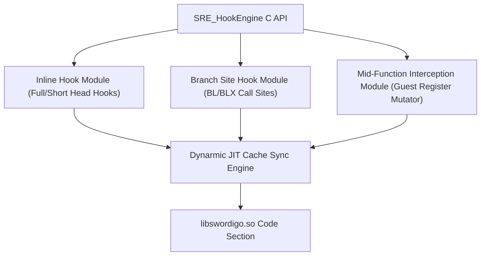

# SRE Next-Gen Inline Trampoline & Hook Engine Specification

> **Document Path**: `docs/inline-trampline-for-sre/03_sre_nextgen_inline_hook_engine_specification.md`
> **Target Subsystem**: SRE Native Hooking Framework (`SRE_HookEngine`)
> **Design Goal**: Combine GlossHook's extensibility with SRE's Dynarmic JIT & PC Port infrastructure.

---

## 1. Engine Architecture & API Overview

`SRE_HookEngine` provides a lightweight, modular, and extensible native C API designed specifically for Swordigo Runtime Engine (SRE).



---

## 2. Header Specification (`sre_hook_engine.h`)

```c
#ifndef SRE_HOOK_ENGINE_H
#define SRE_HOOK_ENGINE_H

#include <stdint.h>
#include <stdbool.h>
#include <stddef.h>

#ifdef __cplusplus
extern "C" {
#endif

typedef void* SRE_HookHandle;

/* Architectural Guest Register Context Mirror */
typedef struct SRE_GuestRegs {
    uint64_t x[31];     /* X0 - X30 */
    uint64_t sp;        /* Stack Pointer */
    uint64_t pc;        /* Program Counter */
    uint64_t cpsr;      /* CPSR / Flags */
    uint8_t  q[32][16]; /* Vector Registers Q0-Q31 (128-bit each) */
} SRE_GuestRegs;

typedef void (*SRE_InternalCallback)(SRE_GuestRegs* regs, SRE_HookHandle handle);

/* =========================================================================
 * Primary Hooking APIs
 * ========================================================================= */

/**
 * Hook a function entry point by guest virtual address.
 */
SRE_HookHandle SRE_Hook(uint64_t target_addr, void* proxy_func, void** orig_func_ptr);

/**
 * Hook a 4-byte short function head using a relative branch stub.
 */
SRE_HookHandle SRE_HookShort(uint64_t target_addr, void* proxy_func, void** orig_func_ptr);

/**
 * Hook a single branch instruction call site (BL/BLX) inside a guest function.
 */
SRE_HookHandle SRE_HookBranch(uint64_t branch_addr, void* proxy_func, void** orig_func_ptr);

/**
 * Hook an arbitrary mid-function instruction, exposing full guest register context.
 */
SRE_HookHandle SRE_HookInternal(uint64_t target_addr, SRE_InternalCallback callback);

/* =========================================================================
 * Lifecycle & State Control APIs
 * ========================================================================= */

bool SRE_HookEnable(SRE_HookHandle handle);
bool SRE_HookDisable(SRE_HookHandle handle);
bool SRE_HookDelete(SRE_HookHandle handle);

void* SRE_HookGetOriginal(SRE_HookHandle handle);

#ifdef __cplusplus
}
#endif

#endif /* SRE_HOOK_ENGINE_H */
```

---

## 3. Implementation Workflow & Execution Flow

### 3.1 Hook Installation Pipeline
1. **Target Validation**: Verify `target_addr` lies within `g_swordigo_base` address bounds.
2. **Instruction Disassembly**: Parse the first 16 bytes (or 4 bytes for `SRE_HookShort`) to ensure instruction alignment.
3. **Trampoline Allocation**: Allocate a trampoline page from the SRE Proximity Memory Pool ($\pm 128\text{ MB}$).
4. **Relocation Emulation**: Copy original target instructions to the trampoline, relocating relative offsets (`ADRP`, `LDR`, `B.cond`).
5. **Memory Protection & Patching**:
   - `mprotect` target page to `PROT_READ | PROT_WRITE | PROT_EXEC`.
   - Write trampoline jump opcode sequence.
   - `mprotect` target page back to `PROT_READ | PROT_EXEC`.
6. **Dynarmic JIT Cache Sync**: Call `Dynarmic::InvalidateCacheRange(target_addr, patch_size)` to ensure Dynarmic compiles the newly patched instructions immediately.

---

## 4. Also Synchronized to TVPG Tooling Repository

This specification is saved in both:
- `SwordigoDesktop/docs/inline-trampline-for-sre/`
- `/run/media/quantumcreeper/TVPG/Prenxy Packages/SwordigoTools/RESEARCH/inline-trampline-for-sre/`
