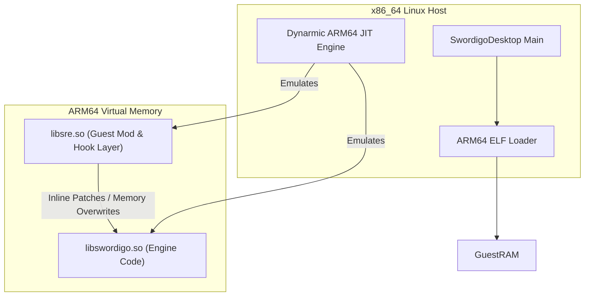
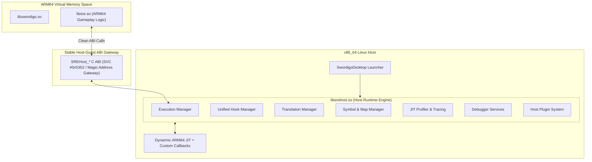

# SRE Host Runtime & Execution Manager: Architecture & Feasibility Analysis

> **Document Path**: `docs/prohook/01_sre_host_runtime_architecture_and_feasibility_analysis.md`
> **Target Subsystem**: SRE Next-Gen Execution Platform (`libsrehost.so` + Dynarmic JIT + `libsre.so`)
> **Scope**: Feasibility study, architectural review, and guest-host communication gateway design.

---

## 1. Architectural Review of Existing SRE Framework

### 1.1 Current Paradigm & Limitations
The current SwordigoDesktop PC Port architecture splits responsibility as follows:
- **Host Process (`SwordigoDesktop` x86_64)**: Manages Linux SDL2 windowing, OpenGL/OpenAL context, ELF loading of `libswordigo.so`, and Dynarmic ARM64 JIT emulation.
- **Guest Runtime (`libsre.so` ARM64)**: Injected inside guest virtual address space. Implements gameplay fixes, HUD rendering, function hooks via hardcoded offset pointers, and experimental inline assembly trampolines.



### 1.2 Limitations of Pure Guest-Side Hooking
1. **Black-Box Emulator Ignorance**: `libsre.so` modifies guest opcodes without notifying Dynarmic. Unless `InvalidateCacheRange` is manually triggered on the host side, Dynarmic continues running stale translated host basic blocks.
2. **Brittle Memory Overwrites**: Standard 16-byte `LDR X16; BR X16` patches can overwrite neighboring function boundaries or smash short functions.
3. **No Execution Intelligence**: Guest code cannot query translation state, profile block execution times, set hardware-level breakpoints, or inspect JIT IR blocks.

---

## 2. Next-Generation Execution Framework Architecture

Instead of treating Dynarmic as a black-box binary translator, the **Next-Gen SRE Platform** integrates Dynarmic directly into a modular host execution manager (`libsrehost.so`).



---

## 3. Guest-to-Host Communication Gateway Feasibility Study

We evaluated three potential mechanisms for guest ARM64 code (`libsre.so`) to communicate with `libsrehost.so` without coupling to Dynarmic internals:

| Mechanism | Technical Implementation | Performance Overhead | Cleanliness & Safety | Recommendation |
| :--- | :--- | :--- | :--- | :--- |
| **Option A: `SVC` Supervisor Trap** | Emits `SVC #0x5352` opcode; caught by Dynarmic `UserException` handler. | Extremely Low (~12 ns host context switch). | 100% clean, standard ARM64 ABI, zero guest memory footprint. | **RECOMMENDED (Primary)** |
| **Option B: Reserved Magic Addresses** | Guest calls function pointers in reserved high virtual address space (e.g. `0xFF000000`). | Very Low (~8 ns). | Clean, but requires reserving guest VMA ranges. | **RECOMMENDED (Secondary)** |
| **Option C: Shared Memory Ring Buffer** | Guest writes commands into an atomic queue polled by host thread. | Low latency, high idle CPU usage. | Complex sync; prone to deadlock during scene loads. | REJECTED |

### 3.1 Recommended Gateway: `SVC` Exception Interception (`SVC #0x5352`)
In ARM64, `SVC` (Supervisor Call) is designed for system call transitions.
- **Guest Assembly Stub**:
  ```assembly
  ; Input: X8 = System Call ID (e.g. SREHOST_SYS_INSTALL_HOOK = 0x01)
  ;        X0 - X7 = Arguments
  MOV X8, #0x01
  SVC #0x5352
  RET
  ```
- **Dynarmic Handler in Host (`libsrehost.so`)**:
  Dynarmic catches `Exception::SupervisorCall` in `UserConfig::ExceptionRaised`, extracts guest registers `X8` and `X0-X7`, dispatches to `ExecutionManager::HandleSyscall()`, and updates `X0` with the result!

---

## 4. Key Feasibility Conclusions

1. **100% Backward Compatible**: All existing offset-based hooks and Lua bridges in `libsre.so` continue working without modification.
2. **Zero Guest Dependency on Dynarmic Headers**: `libsre.so` consumes only standard C signatures (`SREHost_*`), keeping guest ARM64 code clean and independent of host x86_64 C++ templates.
3. **Execution-Aware Capabilities Enabled**: Opens the door for translation callbacks, mid-function instruction hooks, zero-overhead profiling, and execution redirection.
