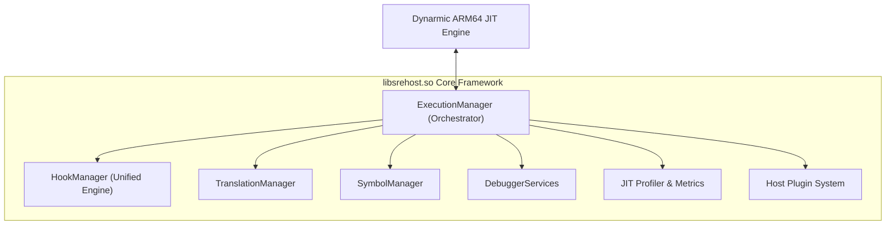
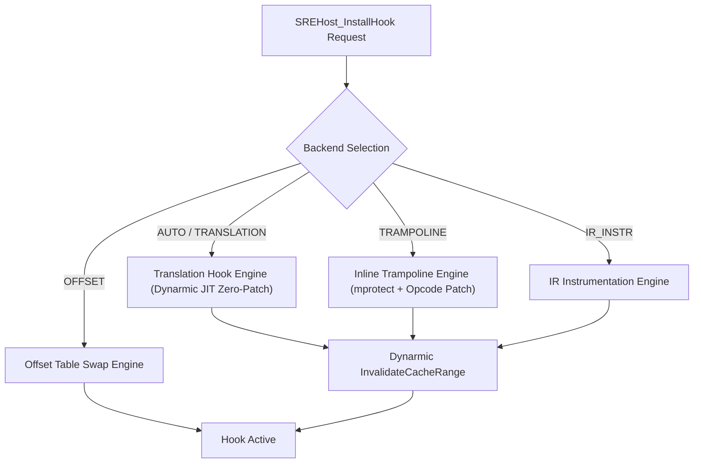

# Host Runtime (`libsrehost.so`) Architecture & Guest ABI Specification

> **Document Path**: `docs/prohook/03_libsrehost_and_libsre_abi_specification.md`
> **Target Subsystems**: `libsrehost.so` (Host execution manager) & `libsre.so` (ARM64 guest runtime)
> **Interface**: Stable C Host ABI Gateway (`SREHost_*`)

---

## 1. `libsrehost.so` Subsystem Architecture

`libsrehost.so` is an independent x86_64 Linux shared library that manages the emulator execution state, JIT translation cache, unified hooking backends, symbol lookup, and profiling.



### 1.1 Class & Subsystem Responsibilities

| Subsystem | Responsibilities |
| :--- | :--- |
| **`ExecutionManager`** | Manages JIT startup, exception dispatch, `SVC` system call processing, and guest thread context state. |
| **`HookManager`** | Unified interface exposing 4 distinct backend hook engines (`OFFSET`, `TRAMPOLINE`, `TRANSLATION`, `IR_INSTRUMENTATION`). |
| **`TranslationManager`** | Tracks JIT translated basic blocks, tracks guest PC $\leftrightarrow$ host JIT code mappings, and handles range invalidations. |
| **`SymbolManager`** | Demangles C++ symbols, parses `libswordigo.so` ELF symtab/strtab, and maps addresses to IDA function names. |
| **`DebuggerServices`** | Provides execution pause, single-stepping, guest memory inspection, and register inspection APIs. |
| **`Profiler`** | Tracks per-function execution ticks, basic block hit counts, draw call counts, and vertex throughput. |
| **`PluginSystem`** | Dynamically loads x86_64 host plugins (`.so`) at launcher startup. |

---

## 2. Complete Host ABI Specification (`SREHost_*`)

Guest ARM64 code (`libsre.so`) calls host execution services exclusively through the stable `SREHost_*` C ABI:

```c
#ifndef SRE_HOST_ABI_H
#define SRE_HOST_ABI_H

#include <stdint.h>
#include <stdbool.h>
#include <stddef.h>

#ifdef __cplusplus
extern "C" {
#endif

/* Unified Hook Backend Types */
typedef enum SREHost_HookBackend {
    SREHOST_BACKEND_AUTO         = 0,  /* Automatically select best backend */
    SREHOST_BACKEND_OFFSET       = 1,  /* Legacy function pointer swap */
    SREHOST_BACKEND_TRAMPOLINE   = 2,  /* Inline opcode patch (16-byte/4-byte) */
    SREHOST_BACKEND_TRANSLATION  = 3,  /* Dynarmic JIT Zero-Patch Hook */
    SREHOST_BACKEND_IR_INSTR     = 4   /* Dynamic IR counter injection */
} SREHost_HookBackend;

typedef void* SREHost_HookHandle;

/* =========================================================================
 * Core Execution & Hook Management APIs
 * ========================================================================= */

/**
 * Install a hook on a guest function or address.
 */
SREHost_HookHandle SREHost_InstallHook(
    uint64_t target_vaddr,
    void* proxy_func,
    void** orig_func_out,
    SREHost_HookBackend backend
);

/**
 * Remove an installed hook and restore execution state.
 */
bool SREHost_RemoveHook(SREHost_HookHandle handle);

/**
 * Resolve a symbol address by demangled name in libswordigo.so.
 */
uint64_t SREHost_GetSymbol(const char* symbol_name);

/**
 * Invalidate a range of guest virtual addresses in the Dynarmic JIT cache.
 */
void SREHost_InvalidateGuestRange(uint64_t guest_vaddr, size_t size);

/**
 * Query host x86_64 machine code pointer for a translated guest PC.
 */
void* SREHost_GetHostBlock(uint64_t guest_vaddr);

/* =========================================================================
 * Diagnostics, Logging & Profiling APIs
 * ========================================================================= */

/**
 * Emit diagnostic log from guest to host log system.
 */
void SREHost_Log(int log_level, const char* tag, const char* message);

/**
 * Begin high-precision execution profiling region.
 */
void SREHost_ProfileBegin(const char* region_name);

/**
 * End high-precision execution profiling region.
 */
void SREHost_ProfileEnd(const char* region_name);

#ifdef __cplusplus
}
#endif

#endif /* SRE_HOST_ABI_H */
```

---

## 3. Hook Backend Dispatch Matrix

When `SREHost_InstallHook(target_vaddr, proxy_func, orig_out, backend)` is called:


