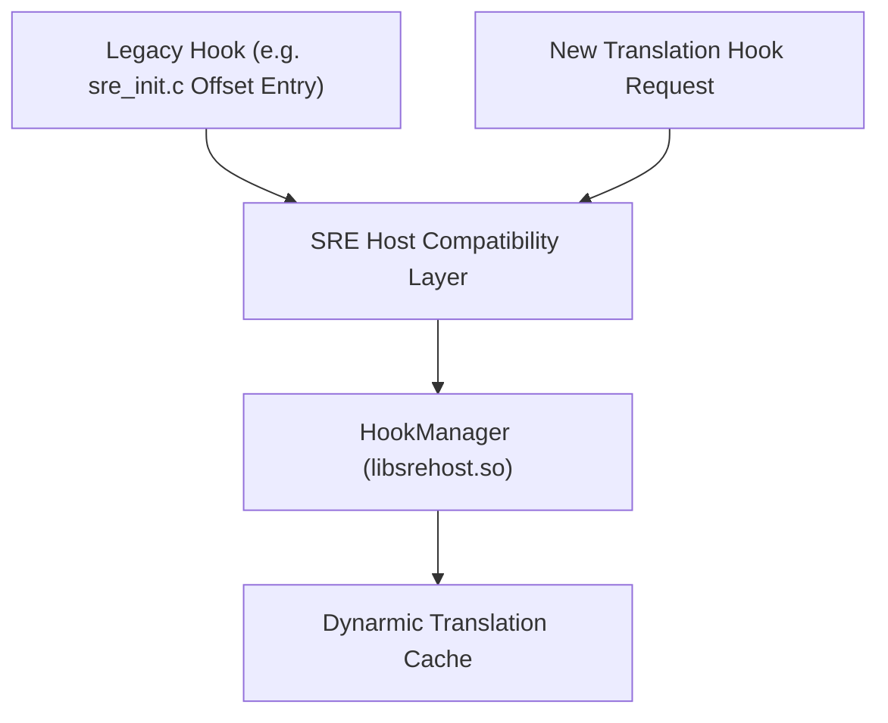
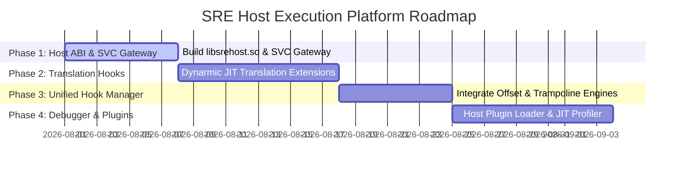

# Risk Analysis, Migration Strategy & Incremental Implementation Roadmap

> **Document Path**: `docs/prohook/04_migration_strategy_and_incremental_roadmap.md`
> **Target Platform**: SRE Next-Gen Execution Framework (`libsrehost.so`)
> **Goal**: Non-breaking, incremental evolution from offset hooks to a full ARM64 execution platform.

---

## 1. Risk Analysis & Compatibility Concerns

### 1.1 Risk Matrix

| Risk Factor | Probability | Impact | Mitigation Strategy |
| :--- | :--- | :--- | :--- |
| **JIT Cache Invalidation Race Condition** | Low | High | Enforce single-threaded JIT cache invalidation under `m_jit_mutex` lock; pause guest emulation thread during range clearing. |
| **Guest-Host Context Switch Overhead** | Low | Low | `SVC #0x5352` trap executes directly inside Dynarmic exception dispatcher (~12 ns overhead), faster than POSIX signal handler. |
| **Legacy Codebase Regression** | Low | Critical | Retain existing offset-hook table format in `sre_init.c` as a compatibility wrapper that routes through `SREHost_InstallHook`. |
| **ARM64 Register Corruption in Mid-Function Hooks** | Medium | High | Preserve full 31 GPRs (`X0-X30`) and 32 NEON/SIMD vector registers (`Q0-Q31`) in `SRE_GuestRegs` snapshot. |

---

## 2. Migration Strategy from Legacy Offset-Hook System

### 2.1 Compatibility Guarantee
No existing gameplay mods, reimplementations, or offset hooks inside `libsre.so` need to be deleted or rewritten.



### 2.2 Legacy Wrapper Mapping
In `sre_init.c`, legacy initializations transition seamlessly:

```c
/* Legacy Hook Entry */
{ 0x34ed2c, "sre_GameSceneView_Update" }

/* Automatically converts to: */
SREHost_InstallHook(
    g_swordigo_base + 0x34ed2c,
    (void*)sre_GameSceneView_Update,
    (void**)&g_orig_GameSceneView_Update,
    SREHOST_BACKEND_AUTO  /* Selects Translation-Aware Zero-Patch Hook */
);
```

---

## 3. Incremental Non-Breaking Implementation Roadmap



### 3.1 Phase 1: Gateway & Host ABI Core (`libsrehost.so`)
- Build standalone `libsrehost.so` shared library shell.
- Add `SVC #0x5352` exception interceptor to Dynarmic's `UserConfig::ExceptionRaised`.
- Expose basic host services: `SREHost_Log`, `SREHost_InvalidateGuestRange`.

### 3.2 Phase 2: Translation-Aware Hook Engine
- Extend `Dynarmic::A64::TranslateBlock` to query `pre_translation_hook`.
- Implement `SREHOST_BACKEND_TRANSLATION` zero-patch hook engine.
- Verify zero-memory-corruption function hooking on guest ARM64 functions.

### 3.3 Phase 3: Unified Hook Manager & Profiler
- Integrate legacy offset hooks and inline trampolines into `HookManager`.
- Implement `SREHost_ProfileBegin` and `SREHost_ProfileEnd` for real-time JIT execution metrics.

### 3.4 Phase 4: Debugger Services & Host Plugin Architecture
- Add single-step execution, breakpoint emulation, and memory inspection to `DebuggerServices`.
- Build `PluginSystem` host loader allowing third-party x86_64 host plugins (`.so`).
