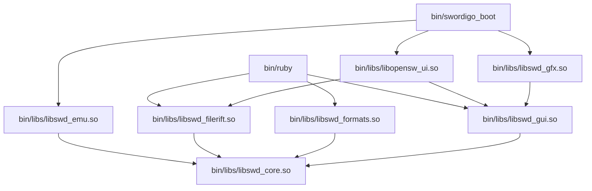

# ELF Shared Object Namespaced Architecture

## Executive Summary
This document specifies the ELF Shared Object (`.so`) design, symbol visibility policies, dependency hierarchy, and runtime dynamic linking flags (`RPATH`/`RUNPATH`) for the modularized `SwordigoDesktop` architecture stored inside `bin/libs/`.

---

## 1. Library Namespaces & Naming Hierarchy

The modular shared objects are stored in `bin/libs/` and follow a strict namespaced naming convention:
- **`libswd_<subsystem>.so`**: Core platform, UI, texture decoding, and engine utilities shared between host applications.
- **`libopensw_<subsystem>.so`**: High-level modding features, Swordfare GUI, and OpenSwordigo extensions.

---

## 2. Shared Library Specification (`bin/libs/`)

### A. `bin/libs/libswd_core.so` (Base Platform Utilities)
- **Sources**: `src/platform/data_path.cpp`, `src/platform/io_thread.cpp`, `src/platform/rgc.cpp`, `src/android/log.c`
- **Dependencies**: `-ldl`, `-lpthread`

### B. `bin/libs/libswd_gui.so` (ImGui Core & Rendering Integration)
- **Sources**: `src/imgui/*.cpp`, `src/imgui/backends/imgui_impl_sdl3.cpp`, `src/imgui/backends/imgui_impl_opengl3.cpp`, `src/imgui/backends/imgui_impl_vulkan.cpp`
- **Dependencies**: `libswd_core.so`, `SDL3`, `libGL`

### C. `bin/libs/libswd_formats.so` (Texture & Image Decoders)
- **Sources**: `src/platform/pvr_loader.cpp`, `src/platform/pvrtc_decoder.cpp`
- **Dependencies**: `libswd_core.so`

### D. `bin/libs/libswd_filerift.so` (Filerift Engine & Host Lua Environment)
- **Sources**: `src/tools/filerift.cpp`, `src/tools/scene_schemas.cpp`, `src/tools/boulder.cpp`, Host Lua 5.1 (`src/sre/lua/src/*.c`)
- **Dependencies**: `libswd_core.so`, `libswd_formats.so`, `zlib`

### E. `bin/libs/libswd_gfx.so` (Graphics & Post-Processing Pipeline)
- **Sources**: `src/platform/vulkan_backend.cpp`, `src/platform/fbo_scaler.cpp`, `src/platform/video_background.cpp`, `src/platform/srt_overlay.cpp`
- **Dependencies**: `libswd_core.so`, `libswd_gui.so`, `SDL3`, `libGL`, `libvulkan`, local static FFmpeg

### F. `bin/libs/libswd_emu.so` (ARM32/ARM64 Emulation Core)
- **Sources**: `src/loader/elf_loader.cpp`, `src/loader/elf_loader_arm64.cpp`, `src/platform/emulator.cpp`, `src/platform/emulator_arm64.cpp`, `src/platform/emulator_dynarmic64.cpp`, `src/jni/jni_bridge.cpp`, `src/jni/jni_bridge_arm64.cpp`, `src/jni/jni_marshaller.cpp`
- **Dependencies**: `libswd_core.so`, `libswd_gfx.so`, `-lunicorn`, `-ldynarmic`, `-lmcl`, `-lfmt`, `-lZydis`, `-lZycore`

### G. `bin/libs/libopensw_ui.so` (Swordfare Overlay & Mod Launcher)
- **Sources**: `src/platform/swordfare_gui.cpp`, `src/platform/launcher_ui.cpp`, `src/platform/save_editor.cpp`, `src/platform/scl_parser.cpp`, `src/game/mod_tools.cpp`, `src/game/mod_config.cpp`, `src/game/save_editor_logic.cpp`, `src/game/camera_override.cpp`
- **Dependencies**: `libswd_core.so`, `libswd_gui.so`, `libswd_filerift.so`

---

## 3. Dynamic Linker & RPATH Configuration

To allow binaries in `bin/` (`bin/swordigo_boot`, `bin/ruby`) to automatically load libraries from `bin/libs/`:
- Link binaries and shared libraries with: `-Wl,-rpath,'$ORIGIN/libs:$ORIGIN'`
- This ensures `bin/swordigo_boot` automatically resolves `bin/libs/libswd_*.so` and `bin/libs/libopensw_*.so` at runtime without `LD_LIBRARY_PATH` dependency.
