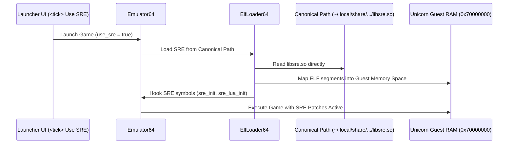

# Libsre.so Deduplication & Dynamic Loading Plan

## Executive Summary
Currently, `libsre.so` (Swordigo Runtime Engine for ARM64) is copied across multiple installation and instance directories (e.g. root repository, engine cache, per-profile save folders, `~/.local/share/swordigo-desktop/engine/...`), creating significant storage duplication and maintenance overhead when `libsre.so` is updated.

This document details the single canonical storage architecture and dynamic loading mechanism when the launcher `<tick> use sre` option is toggled.

---

## 1. Current Storage Inefficiency

- **Size of `libsre.so`**: ~693 KB (cross-compiled ARM64 shared library).
- **Current Behavior**:
  - `libsre.so` compiled into root `./libsre.so`.
  - Copied to `~/.local/share/swordigo-desktop/engine/v1.4.12/arm64-v8a/libsre.so` via `make install-sre`.
  - Copied into individual game profile/instance directories whenever a new instance is launched with SRE enabled.
  - Result: 10+ identical copies of `libsre.so` scattered across disk.

---

## 2. Canonical Central Repository Architecture

`libsre.so` will be built and maintained in **one single canonical directory**:
- System Path: `~/.local/share/swordigo-desktop/engine/v1.4.12/arm64-v8a/libsre.so`
- Local Fallback Path: `lib/libsre.so` (or `bin/libsre.so`)

No instance or profile directory will ever copy `libsre.so`.

---

## 3. Dynamic Unicorn Guest Mapping Plan (`<tick> use sre`)

When the launcher `<tick> use sre` option is enabled in `SwordfireGUI` / `LauncherUI`:

1. **Path Resolution**:
   `Emulator64` queries `DataPath::get_sre_library_path()`, which checks:
   - Primary: `~/.local/share/swordigo-desktop/engine/v1.4.12/arm64-v8a/libsre.so`
   - Secondary: `./lib/libsre.so`
   
2. **Direct Guest Allocation & Loading**:
   Instead of copying the file to the instance folder on disk:
   - `ElfLoader64` opens the canonical `libsre.so` directly.
   - Maps `.text`, `.rodata`, `.data`, `.bss` sections directly into Unicorn guest memory space at `0x70000000`.
   - Binds SRE hooks and symbols directly in Unicorn without creating duplicate temporary files on disk.

3. **Launcher GUI Tick Toggle Integration**:
   - `src/game/mod_config.cpp`: `bool g_use_sre = true;`
   - `src/platform/launcher_ui.cpp`: ImGui checkbox `ImGui::Checkbox("Use SRE (Swordigo Runtime Engine)", &g_use_sre);`
   - When unchecked: `Emulator64` bypasses SRE guest mapping entirely.
   - When checked: `Emulator64` loads `libsre.so` directly from canonical path without disk duplication.

