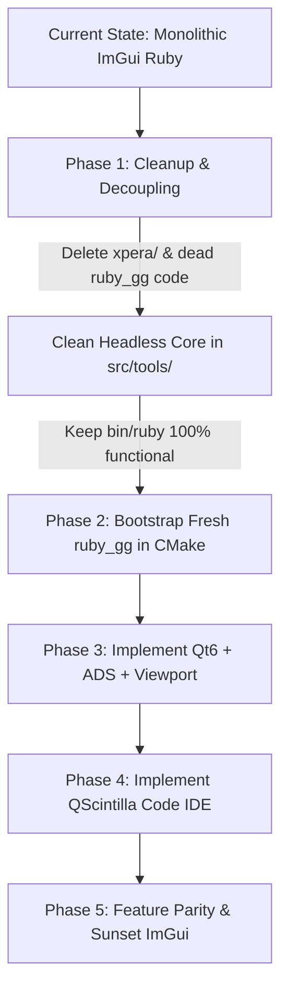

# Ruby Studio (Ruby GG) — UI Framework Research & Architecture Feasibility Study

---

## 1. Executive Summary & Problem Diagnosis

The current implementation of **Ruby** (`bin/ruby`) relies on **Dear ImGui**, with the entire studio logic centered around an 18,000+ line monolithic source file (`src/tools/asset_viewer.cpp`). While Dear ImGui was instrumental for early reverse-engineering and quick prototyping of Swordigo's PowerVR POD and Scene formats, the studio has outgrown ImGui's core architectural design.

### 1.1 Why Dear ImGui Collapses for Full Engine / IDE Studios

| Limitation in ImGui | Real-World Impact on Ruby Studio |
|---|---|
| **Immediate Mode Frame Churn** | ImGui traverses the entire UI tree and recalculates layouts, vertices, and draw lists every single frame (at 60–144 Hz). When idle, Ruby consumes unnecessary CPU and GPU cycles, draining battery on laptops and creating rendering contention with complex 3D scenes. |
| **Code Editor Virtualization Barrier** | ImGui has no native virtualized text buffer (e.g., Piece Table or Rope buffer). Naive multi-line text edit widgets in ImGui allocate and measure every character each frame. At **multi-lakh lines** (100,000–500,000+ lines of decompiled Swordigo SCL, Lua scripts, shader source, or C++ dumps), ImGui completely freezes, stutters, and exhausts CPU caches. |
| **Monolithic Architecture Trap** | Immediate mode strongly tempts developers to interleave state mutation, OpenGL draw calls, input handling, and layout code directly within widget render loops. This is how `asset_viewer.cpp` grew into an unmaintainable 18,194-line file with hundreds of global `ViewerState` flags. |
| **Aesthetic Ceilings & Tool Polish** | While ImGui can be themed with custom colors, its widgets lack modern fluid animation, multi-window docking persistence, sub-pixel text rendering, native OS file dialogs/menus, and flexible flexbox/grid layout systems. It invariably feels like an internal game debug overlay rather than a commercial-grade studio. |

### 1.2 Post-Mortem of Failed Alternative Attempts

1. **The Godot Approach (`ruby_gg` / `SwordigoRefresh`):**
   - **Why it failed:** Godot carries an entire 100MB+ game engine (physics engines, audio buses, 2D/3D renderers, scene format serializers, GDScript/Mono virtual machines). Trying to use Godot solely as a GUI framework for reverse-engineering Swordigo forced the team to drag along massive baggage that fought against Swordigo's low-level binary formats (PowerVR POD, SCL, PVR textures).
2. **The Custom From-Scratch Approach (`xpera/`):**
   - **Why it failed:** Building a retained-mode UI framework from scratch (`src/xpera/`) is a notorious engineering trap. Text rasterization, HarfBuzz font shaping, BiDi, IME input, text selection cursor mechanics, scrolling inertia, event bubbling, flex layouts, and docking take dedicated teams years to stabilize. Deleting `src/xpera/` is the correct decision.

---

## 2. Framework Evaluation Matrix for "Ruby GG"

To replace ImGui in the future **Ruby GG** (while leaving the legacy ImGui edition intact), any candidate framework must satisfy **6 non-negotiable criteria**:
1. **Multi-Lakh Line Code Editing**: Rock-solid, smooth editing of 100k–500k+ lines with syntax highlighting, code folding, and zero frame drops.
2. **First-Class 3D Viewport**: Seamless embedding of custom OpenGL / Vulkan render contexts without texture copying overhead.
3. **Native C/C++ Performance**: No heavy virtual machines, no garbage collection pauses, fast compilation, and direct linkage to `src/tools/` backends.
4. **Modern Studio Aesthetic**: Sleek, dark, customizable, professional aesthetic comparable to Blender 4, Unreal Engine 5, VS Code, or Zed.
5. **Cross-Platform**: First-class support for both Linux (X11 & Wayland) and Windows.
6. **Modular / Dockable Architecture**: Clean separation of Viewports, Inspectors, Scene Trees, Asset Browsers, and Code Editors.

### Comparative Scoring Matrix

| Framework | Multi-Lakh Code Editor | 3D Viewport Embedding | Native C++ Integration | UI Aesthetic & Docking | Binary Footprint | Verdict |
|---|---|---|---|---|---|---|
| **Qt 6 (Widgets + ADS + QScintilla)** | ⭐⭐⭐⭐⭐ (Scintilla / Kate) | ⭐⭐⭐⭐⭐ (`QOpenGLWidget`) | ⭐⭐⭐⭐⭐ (Native C++17/20) | ⭐⭐⭐⭐⭐ (Commercial DCC Standard) | 25–45 MB | **WINNER (Top Pick)** |
| **Qt 6 (QML / Qt Quick)** | ⭐⭐⭐ (Needs custom bridge) | ⭐⭐⭐⭐⭐ (`QQuickFramebufferObject`) | ⭐⭐⭐⭐ (C++ / QML bridge) | ⭐⭐⭐⭐⭐ (Fluid, GPU accelerated) | 30–50 MB | **Strong Contender** |
| **Slint (C++ / Rust)** | ⭐ (No virtualized editor) | ⭐⭐⭐ (Raw OpenGL surface) | ⭐⭐⭐⭐ (Native C++ bindings) | ⭐⭐⭐⭐ (Modern declarative) | 5–12 MB | **Not Ready for IDEs** |
| **Tauri v2 (Monaco + C++)** | ⭐⭐⭐⭐⭐ (Monaco Engine) | ⭐⭐ (Texture share / IPC bridge) | ⭐⭐ (Rust / Web IPC barrier) | ⭐⭐⭐⭐⭐ (Web / CSS polish) | 15–30 MB | **Poor for 3D Viewports** |
| **RmlUi (HTML/CSS in C++)** | ⭐ (No code editor widget) | ⭐⭐⭐⭐⭐ (In-engine render) | ⭐⭐⭐⭐⭐ (Native C++) | ⭐⭐⭐ (Game HUD focused) | < 5 MB | **Too Low-Level** |
| **wxWidgets** | ⭐⭐⭐⭐ (wxStyledTextCtrl) | ⭐⭐⭐⭐ (wxGLCanvas) | ⭐⭐⭐⭐⭐ (Native C++) | ⭐⭐ (Looks dated / Win32) | 15–25 MB | **Aesthetically Unfit** |

---

## 3. Deep Dive into the Top Candidates

### Contender A: Qt 6 (C++20 + Qt-Advanced-Docking-System + QScintilla / Tree-Sitter)

> [!IMPORTANT]
> **Industrial Precedent:** Qt is the undisputed industry standard for professional 3D and Game Engine digital content creation tools. **Autodesk Maya, 3ds Max, SideFX Houdini, Substance 3D Painter/Designer, CryEngine Sandbox, Unreal Engine Tooling, and DaVinci Resolve** all use Qt.

#### Why it fits Ruby GG perfectly:
1. **Multi-Lakh Line Code Editing:**
   - By integrating **QScintilla** (or a Kate/KTextEditor widget), Ruby GG gets the battle-tested Scintilla engine used by Notepad++ and IDEs worldwide.
   - It handles **500,000+ lines** effortlessly using gap-buffer/piece-table memory virtualization. Only visible lines are styled and rendered.
   - Built-in support for syntax styling, line numbers, code folding, bracket matching, and auto-indentation for Swordigo Lua scripts, SCL definitions, shaders, and decompiled C dumps.
2. **Zero-Overhead 3D Viewport:**
   - `QOpenGLWidget` or `QWindow::fromWinId` allows Ruby's existing `av_renderer.cpp`, `av::render_mesh`, and OpenGL FBO pipelines to render directly into the viewport with zero pixel copies or latency.
   - Multiple viewports (Scene View, Model Preview, Collision Mesh Editor) can share OpenGL contexts natively.
3. **Docking & Studio Workspaces:**
   - Using **Qt-Advanced-Docking-System (ADS)** (the open-source docking system used in professional game engines), users can dock, float, tab, split, and persist window layouts across multiple monitors exactly like Unreal Engine 5 or Blender.
4. **Theme & Modern Look:**
   - Qt can be styled with custom QSS (Qt Style Sheets) or modern palette engines to look indistinguishable from Blender 4 or Unreal Engine 5 (clean dark grays, crisp SVG icons, refined typography).
5. **Clean Architecture:**
   - Signals & Slots and model-view architecture enforce strict separation of UI from the backend. The 18,000-line monolith of `asset_viewer.cpp` is broken down into clean, modular controller classes.

---

### Contender B: Slint (C++ & Declarative DSL)

- **What it is:** A modern GUI toolkit created by former Qt core engineers, designed for embedded and desktop apps with a lightweight declarative `.slint` markup language that compiles directly to C++ headers.
- **Why it is attractive:** Extremely lightweight, fast build times, clean syntax, modern reactive architecture.
- **Why it falls short for Ruby GG:**
  - **No virtualized code editor:** Slint currently lacks a virtualized rich code editor component capable of handling 100,000+ lines with syntax highlighting and code folding.
  - You would have to implement virtualized line rendering and syntax lexing from scratch—plunging back into the same trap as `xpera`.

---

### Contender C: Tauri v2 + Monaco Editor + Embedded Viewport

- **What it is:** A desktop web-view shell hosting the Monaco Editor (the engine powering VS Code) with a native backend.
- **Why it is attractive:** Monaco is arguably the best code editor in the world for large files, syntax highlighting, and LSP integration.
- **Why it falls short for Ruby GG:**
  - Embedding a 60 FPS interactive 3D OpenGL viewport (with gizmos, picking, raycasting, and vertex edits) into an HTML/WebView DOM involves complex IPC texture sharing (Spout on Windows, DMA-BUF on Linux) or clumsy offscreen rendering.
  - The latency and architectural friction between native C++ engine code and web frontend makes it suboptimal for interactive 3D tools.

---

## 4. Architectural Blueprint for Ruby GG

### 4.1 Recommended Technology Stack

```
┌────────────────────────────────────────────────────────────────────────┐
│                        RUBY GG STUDIO FRONTEND                         │
│                                                                        │
│   ┌───────────────────────────┐      ┌─────────────────────────────┐   │
│   │   Qt-Advanced-Docking     │      │   QScintilla / Tree-Sitter  │   │
│   │   (Layouts, Panels, Tabs) │      │   (Multi-Lakh Line Code IDE)│   │
│   └─────────────┬─────────────┘      └──────────────┬──────────────┘   │
│                 │                                   │                  │
│   ┌─────────────┴─────────────┐      ┌──────────────┴──────────────┐   │
│   │   Ruby 3D Viewport Widget │      │   Property / Inspector UI   │   │
│   │   (QOpenGLWidget Surface) │      │   (Modular Property Grids)  │   │
│   └─────────────┬─────────────┘      └──────────────┬──────────────┘   │
└─────────────────┼───────────────────────────────────┼──────────────────┘
                  │                                   │
                  ▼                                   ▼
┌────────────────────────────────────────────────────────────────────────┐
│                    SWORDIGO HEADLESS ENGINE CORE                       │
│                        (src/tools/ & src/platform/)                    │
│                                                                        │
│   • pod_loader / pod_writer       • scene_loader / scene_creator       │
│   • boulder (GroundMesh)          • filerift (Markup / Proto)          │
│   • av_renderer (Shaders / GL)    • rubymesh (.rbm Binary Engine)      │
│   • batch_converter               • pvr_loader / pvrtc_decoder         │
└────────────────────────────────────────────────────────────────────────┘
```

### 4.2 Module Breakdown

1. **`ruby_gg/core/`**:
   - `StudioContext`: Holds loaded projects, active scenes, and asset database.
   - `CommandBus`: Command pattern for undo/redo (replacing ImGui's ad-hoc snapshots).
2. **`ruby_gg/viewport/`**:
   - `StudioViewportWidget` (subclasses `QOpenGLWidget`):
     - Directly calls Swordigo's `av_renderer` shaders.
     - Implements camera orbits, pan, zoom, gizmos, and object picking.
3. **`ruby_gg/editor/`**:
   - `ScriptIDEWidget` (subclasses `QsciScintilla`):
     - Virtualized multi-lakh line buffer.
     - Swordigo SCL / Lua lexer with keyword coloring, bracket highlighting, and line folding.
4. **`ruby_gg/panels/`**:
   - `SceneHierarchyPanel`: Tree view of scene objects.
   - `InspectorPanel`: Transform controls, component attributes, materials.
   - `AssetBrowserPanel`: Grid/list view of vanilla/mod assets with thumbnails.
   - `ConsolePanel`: Diagnostic logs and command execution.

---

## 5. Migration Strategy & Action Plan



### Phase 1: Repository Hygiene & Core Decoupling
- **Delete `src/xpera/`** and `cmake/components/xpera.cmake`: Remove the failed custom UI framework to declutter the repository.
- **Clean `cmake/components/ruby_gg.cmake`**: Remove references to `libgodot.so` and `deps/godot-*`.
- **Ensure `src/tools/` is 100% Headless**: Verify that core formats (`pod_loader`, `scene_loader`, `boulder`, `rubymesh`) have zero `#include <imgui.h>` dependencies so they link cleanly into any frontend.

### Phase 2: Bootstrap Fresh `ruby_gg` Target
- Set up a clean CMake configuration for `ruby_gg` linking against Qt 6 Core, Gui, Widgets, OpenGLWidgets, and QScintilla.
- The build produces two independent executables:
  - `bin/ruby` (legacy Dear ImGui edition — untouched and fully functional).
  - `bin/ruby_gg` (the next-generation Qt Studio).

### Phase 3: Incremental Panel Implementation
1. **Milestone 1**: Window shell with Qt-Advanced-Docking-System + Dark Studio Theme.
2. **Milestone 2**: Embedded 3D Viewport (`QOpenGLWidget`) rendering Swordigo models (`hiro.POD`, etc.).
3. **Milestone 3**: Code Editor with SCL & Lua syntax highlighting handling 100k+ line files smoothly.
4. **Milestone 4**: Scene Hierarchy & Property Inspector with bidirectional selection.
5. **Milestone 5**: Full scene editing, collision mesh editing, and level generation tools.

---

## 6. Conclusion & Recommendation

- **Dear ImGui** was great for early development, but cannot support a commercial-grade IDE and 3D Studio due to immediate-mode frame overhead and the absence of virtualized text editing.
- **Godot** is too bloated with unneeded engine subsystems.
- **Custom UI (`xpera`)** is an endless development sink.
- **Qt 6 (Widgets + Qt-Advanced-Docking-System + QScintilla)** is the **clear, battle-tested, industrial-strength choice**. It gives Ruby GG:
  - Effortless editing of 500,000+ lines of code without lag.
  - Zero-latency native OpenGL 3D viewport integration.
  - A modern, dockable studio layout matching Blender 4 and Unreal Engine 5.
  - Clean C++20 architecture that finally breaks free from the 18,000-line single-file trap.
