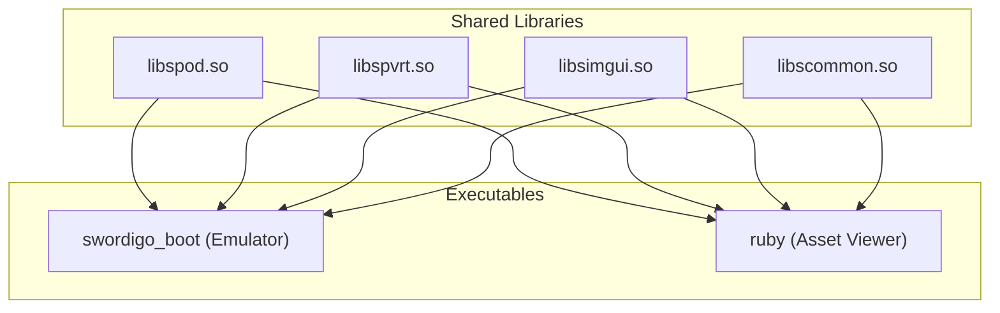

# Research: Shared Library (.so) Architecture for Swordigo Desktop

This document identifies shared source files between the main `swordigo_boot` emulator client and the standalone `ruby` asset viewer, defines a namespace-based shared library architecture, and evaluates its advantages and disadvantages.

---

## 1. Shared Codebase Files

Analyzing the [Makefile](file:///home/quantumcreeper/SwordigoDesktop/Makefile) reveals a significant overlap in source files compiled into both `swordigo_boot` and `ruby`. We can categorize these shared files into four distinct functional modules:

### Module A: POD Archive & Level Schema Parsing
These files handle loading, unpacking, and parsing Swordigo's game packages (`.pod`) and level schemas.
* [src/tools/filerift.cpp](file:///home/quantumcreeper/SwordigoDesktop/src/tools/filerift.cpp) (Archive unpacking)
* [src/tools/scene_schemas.cpp](file:///home/quantumcreeper/SwordigoDesktop/src/tools/scene_schemas.cpp) (Scene schema structures)
* [src/tools/boulder.cpp](file:///home/quantumcreeper/SwordigoDesktop/src/tools/boulder.cpp) (Data compression/decompression helper)

### Module B: PVRTC Texture Processing
These files decode the standard iOS/Android PVRTC texture formats used by the original mobile game assets.
* [src/platform/pvr_loader.cpp](file:///home/quantumcreeper/SwordigoDesktop/src/platform/pvr_loader.cpp) (PVR texture container parser)
* [src/platform/pvrtc_decoder.cpp](file:///home/quantumcreeper/SwordigoDesktop/src/platform/pvrtc_decoder.cpp) (Software PVRTC decoder)

### Module C: Dear ImGui UI Layer
These files form the graphical overlay and development HUD used in both the game emulator and the asset viewer.
* [src/imgui/imgui.cpp](file:///home/quantumcreeper/SwordigoDesktop/src/imgui/imgui.cpp) (Core ImGui)
* [src/imgui/imgui_draw.cpp](file:///home/quantumcreeper/SwordigoDesktop/src/imgui/imgui_draw.cpp) (Drawing commands)
* [src/imgui/imgui_tables.cpp](file:///home/quantumcreeper/SwordigoDesktop/src/imgui/imgui_tables.cpp) (Tables API)
* [src/imgui/imgui_widgets.cpp](file:///home/quantumcreeper/SwordigoDesktop/src/imgui/imgui_widgets.cpp) (Widgets API)
* [src/imgui/backends/imgui_impl_sdl3.cpp](file:///home/quantumcreeper/SwordigoDesktop/src/imgui/backends/imgui_impl_sdl3.cpp) (SDL3 OS binding)
* [src/imgui/backends/imgui_impl_opengl3.cpp](file:///home/quantumcreeper/SwordigoDesktop/src/imgui/backends/imgui_impl_opengl3.cpp) (OpenGL3 renderer backend)

### Module D: Common System Utilities
* [src/platform/data_path.cpp](file:///home/quantumcreeper/SwordigoDesktop/src/platform/data_path.cpp) (OS-specific data/save directory resolution)

---

## 2. Proposed Shared Library Namespace (`libs...`)

To clean up binary linking, we can package these groups into shared objects (`.so`) placed in a `libs` namespace directory (e.g., `./libs/`):



### Proposed Split:
1. **`libspod.so` (Swordigo POD Reader Library):** Contains Module A files.
2. **`libspvrt.so` (Swordigo PVRTC Library):** Contains Module B files.
3. **`libsimgui.so` (ImGui Shared UI Component):** Contains Module C files.
4. **`libscommon.so` (Common Desktop Utilities):** Contains Module D files.

---

## 3. Creating & Linking Shared Objects (Concept)

To build these libraries, compiler flags must include `-fPIC` (Position Independent Code) and `-shared`:

```bash
# 1. Compile object files with position-independent code
g++ -std=c++17 -fPIC -c src/tools/filerift.cpp -o build/filerift.o

# 2. Link objects into shared library
g++ -shared -o libs/libspod.so build/filerift.o build/boulder.o build/scene_schemas.o

# 3. Link executables against shared libraries (specifying rpath for relative lookup)
g++ -o swordigo_boot build/main.o -L./libs -lspod -lspvrt -lsimgui -lscommon -Wl,-rpath,'$ORIGIN/libs'
```

---

## 4. Advantages & Disadvantages

| Dimension | Advantages of Shared Objects | Disadvantages of Shared Objects |
| :--- | :--- | :--- |
| **Storage & Binary Size** | **Significantly Reduced Footprint:** ImGui alone is extremely large. Shared libraries mean these symbols are stored once on disk instead of duplicated inside both `swordigo_boot` and `ruby`. | **Negligible Storage Impact:** For a desktop app of this size (a few megabytes), duplicate static code sizes are negligible compared to texture and audio assets. |
| **Compilation Times** | **Incremental Compilation Speedup:** Modifying emulator code (e.g., [main.cpp](file:///home/quantumcreeper/SwordigoDesktop/src/main.cpp)) only requires linking the changed object file, instead of rebuilding/linking large static code like ImGui every time. | **Makefile Complexity:** Managing compiling rules, dependency resolution (`-MMD`), and library ordering in a manual Makefile is much more verbose. |
| **Distribution & Deployment** | **Modular Patches:** You can update just the renderer backend (`libsimgui.so`) or the PVRTC decoder (`libspvrt.so`) without replacing the main executable. | **Path Dependency Risks:** Linux binaries look in `/usr/lib` by default. Executables will crash at launch with `error while loading shared libraries` unless `-Wl,-rpath` or `LD_LIBRARY_PATH` is perfectly configured. |
| **Memory Utilization** | **Shared RAM:** The OS kernel loads the shared `.so` pages into physical memory once. If both `swordigo_boot` and `ruby` run concurrently, they share memory pages. | **Dynamic Linker Overhead:** Executable startup is marginally slower because the dynamic linker (`ld.so`) must resolve and bind symbol tables at runtime. |
| **Code Isolation** | **Clean Architecture:** Enforces API boundaries between modules, preventing developers from spaghetti-linking dependencies. | **ABI Instability (Fragility):** C++ ABI is unstable across compiler versions. Modifying headers requires rebuilding all dependent `.so` files, otherwise undefined behavior or symbol mismatch crashes occur. |
