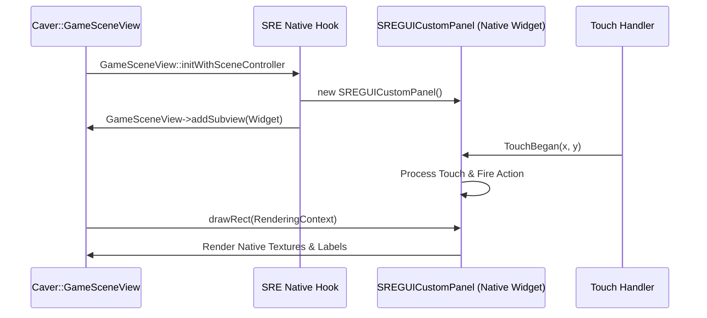

# SRE Native GUI Hooking & Custom Widget Framework Blueprint

## Executive Summary
This document provides a complete technical design and C++ implementation blueprint for hooking Swordigo's native `Caver::GUI` stack in SRE. It details how to inject custom native-style C++ UI widgets into the game's view hierarchy, register touch event handlers, and build custom overlays (e.g. SRE Mod Console, Custom Speedrun Timer, Mini-map Radar) matching vanilla visual styling.

---

## 1. Native GUI Injection Strategy



---

## 2. Complete C++ Implementation Blueprint (`SREGUICustomPanel.h` & `.cpp`)

### Class Definition (`SREGUICustomPanel.h`)
```cpp
#pragma once
#include "docs/gui_stack/02_caver_guiview_core_layout_and_hierarchy.md"
#include "docs/gui_stack/04_caver_guibutton_and_interactive_controls.md"
#include "docs/gui_stack/05_caver_guilabel_and_font_rendering.md"

namespace SRE {

class SREGUICustomPanel : public Caver::GUIView {
public:
    SREGUICustomPanel();
    virtual ~SREGUICustomPanel();

    void setPanelTitle(const std::string& title);
    void addActionButton(const std::string& buttonText, std::function<void()> callback);

    virtual void drawRect(Caver::RenderingContext* ctx, const Caver::Rectangle& dirtyRect, const Caver::Matrix4& parentTransform) override;
    virtual bool TouchBegan(const Caver::FWTouch& touch) override;

private:
    boost::shared_ptr<Caver::GUILabel>                m_header_label;
    std::vector<boost::shared_ptr<Caver::GUIButton>>  m_action_buttons;
    std::vector<std::function<void()>>                 m_button_callbacks;
    Caver::Color4                                      m_background_color;
};

} // namespace SRE
```

### Class Implementation (`SREGUICustomPanel.cpp`)
```cpp
#include "SREGUICustomPanel.h"

namespace SRE {

SREGUICustomPanel::SREGUICustomPanel() {
    // Set frame (position x=20, y=20, width=280, height=200)
    setFrame({20.0f, 20.0f, 280.0f, 20.0f});
    m_background_color = {0.05f, 0.05f, 0.1f, 0.85f}; // Dark glassmorphism background

    // Header Label
    m_header_label.reset(new Caver::GUILabel());
    m_header_label->setFrame({10.0f, 5.0f, 260.0f, 30.0f});
    m_header_label->setFont("default", 16.0f);
    m_header_label->setTextColor({1.0f, 0.85f, 0.2f, 1.0f}); // Gold text
    m_header_label->setText("SRE MOD MENU");
    this->addSubview(m_header_label);
}

SREGUICustomPanel::~SREGUICustomPanel() {}

void SREGUICustomPanel::setPanelTitle(const std::string& title) {
    if (m_header_label) {
        m_header_label->setText(title);
    }
}

void SREGUICustomPanel::addActionButton(const std::string& buttonText, std::function<void()> callback) {
    float y_pos = 40.0f + (m_action_buttons.size() * 35.0f);
    
    boost::shared_ptr<Caver::GUIButton> btn(new Caver::GUIButton());
    btn->setFrame({10.0f, y_pos, 260.0f, 30.0f});
    btn->setTitle(buttonText);
    
    size_t btn_index = m_button_callbacks.size();
    m_button_callbacks.push_back(callback);
    
    btn->setTarget([this, btn_index](Caver::GUIButton* sender) {
        if (btn_index < m_button_callbacks.size() && m_button_callbacks[btn_index]) {
            m_button_callbacks[btn_index]();
        }
    });

    m_action_buttons.push_back(btn);
    this->addSubview(btn);

    // Auto-expand panel height
    Rectangle current_frame = frame();
    current_frame.height = y_pos + 40.0f;
    setFrame(current_frame);
}

void SREGUICustomPanel::drawRect(Caver::RenderingContext* ctx, const Caver::Rectangle& dirtyRect, const Caver::Matrix4& parentTransform) {
    if (isHidden()) return;

    // 1. Render panel background frame with rounded borders
    ctx->drawColoredQuad(m_frame, m_background_color);

    // 2. Render children (Header label + action buttons)
    Caver::GUIView::drawRect(ctx, dirtyRect, parentTransform);
}

bool SREGUICustomPanel::TouchBegan(const Caver::FWTouch& touch) {
    // Intercept touch so clicks on custom UI don't pass through to the player movement controls
    if (pointInside(touch.x, touch.y)) {
        Caver::GUIView::TouchBegan(touch);
        return true; // Consume touch event
    }
    return false;
}

} // namespace SRE
```

---

## 3. Injecting Custom Native UI into Game Scene View

In SRE C++ hook for `GameSceneView::initWithSceneController` (`0x0034E1A0`):

```cpp
void sre_GameSceneView_initWithSceneController_hook(void* self, void* scene_controller) {
    // 1. Execute original GameSceneView initialization
    if (g_orig_GameSceneView_initWithSceneController) {
        g_orig_GameSceneView_initWithSceneController(self, scene_controller);
    }

    // 2. Instantiate custom SRE native panel
    Caver::GameSceneView* gsv = (Caver::GameSceneView*)self;
    
    boost::shared_ptr<SRE::SREGUICustomPanel> custom_panel(new SRE::SREGUICustomPanel());
    custom_panel->setPanelTitle("SRE SPEEDRUNNER TOOLS");
    
    custom_panel->addActionButton("Toggle Godmode", []() {
        // Trigger godmode logic
    });

    custom_panel->addActionButton("Instant Teleport", []() {
        // Trigger warp logic
    });

    // 3. Inject into native GameSceneView hierarchy!
    gsv->addSubview(custom_panel);
    fprintf(stderr, "[SRE/GUI] Injected SREGUICustomPanel directly into native GameSceneView!\n");
}
```
