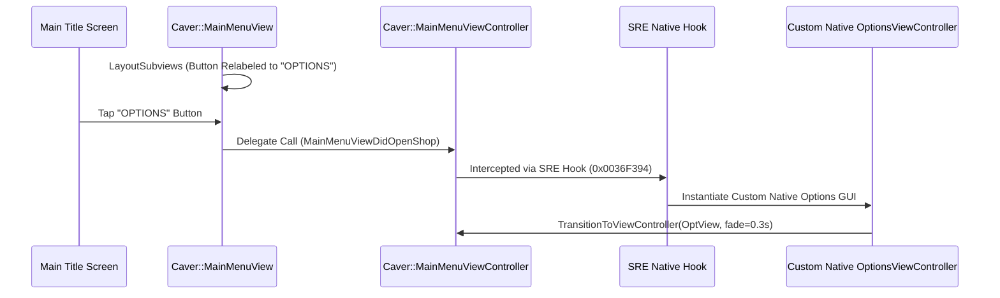

# Custom Native Main Menu Options GUI (`MainMenuViewDidOpenOptions`)

## Executive Summary
This document provides a research analysis and C++ technical design for replacing Swordigo's Main Menu "Shop/Store" button with a **100% Native-Styled Options Menu** (`MainMenuViewDidOpenOptions`). It details how to hook `MainMenuViewController::MainMenuViewDidOpenShop`, re-label the button, and construct a native Caver GUI options window that exposes desktop engine controls (F1 dev options like Vulkan/OpenGL toggle, PostFX shaders, FPS cap, render resolution, and audio levels) directly on the main title screen.

---

## 1. Replacement & Hooking Strategy



### Hooking Points & Address Offsets (v1.4.12)

| Target Function | ARM64 VA (v1.4.12) | ARM32 VA (v1.4.12) | SRE Action |
| :--- | :--- | :--- | :--- |
| `Caver::MainMenuViewController::MainMenuViewDidOpenShop` | `0x0036F394` | `0x001F9E90` | Intercepted to open native options menu instead of store |
| `Caver::MainMenuView::LayoutSubviews` | `0x00393564` | `0x001FAD50` | Re-labels shop button title to `"OPTIONS"` |

---

## 2. Options Included in the Native Options GUI (F1 Migration)

The native options window will expose all key desktop engine settings directly from the main title screen:

```
┌─────────────────────────────────────────────────────────────┐
│                 SWORDIGO DESKTOP OPTIONS                    │
├─────────────────────────────────────────────────────────────┤
│  Graphics Renderer:         [ OpenGL 3.3 ]  [ Vulkan 1.0 ]  │
│  PostFX Shader Preset:      [ Default  ◄              ► ]   │
│  Target Frame Rate (FPS):   [ 30 ]  [ 60 ]  [ 120 ] [ 144 ] │
│  Render Scale Multiplier:   ───●─────────────────  (1.5x)   │
│  Music Volume:              ───────●─────────────  (75%)    │
│  Sound Effects Volume:      ───────────●─────────  (90%)    │
│  Game Difficulty Mode:      [ Normal ]  [ Speedrun Mode ]   │
│  SRE Custom Lua Mods:       [ ON  | OFF ]                   │
│  0-Frame Instant Scene Load:[ ON  | OFF ]                   │
├─────────────────────────────────────────────────────────────┤
│                         [ DONE ]                            │
└─────────────────────────────────────────────────────────────┘
```

---

## 3. Reconstructed C++ Implementation Snippet

### `SRENativeOptionsViewController.h`
```cpp
#pragma once
#include "docs/gui_stack/03_caver_guiviewcontroller_and_navigation_stack.md"
#include "docs/gui_stack/04_caver_guibutton_and_interactive_controls.md"
#include "docs/gui_stack/05_caver_guilabel_and_font_rendering.md"
#include "docs/gui_stack/06_caver_guiimageview_and_texture_mapping.md"

namespace SRE {

class SRENativeOptionsView : public Caver::GUIView {
public:
    SRENativeOptionsView();
    virtual ~SRENativeOptionsView();

    virtual void drawRect(Caver::RenderingContext* ctx, const Caver::Rectangle& dirtyRect, const Caver::Matrix4& parentTransform) override;

private:
    boost::shared_ptr<Caver::GUIImageView> m_background_dialog;
    boost::shared_ptr<Caver::GUILabel>     m_title_label;
    
    // Option Widgets
    boost::shared_ptr<Caver::GUIButton>    m_gfx_opengl_btn;
    boost::shared_ptr<Caver::GUIButton>    m_gfx_vulkan_btn;
    boost::shared_ptr<Caver::GUILabel>     m_postfx_label;
    boost::shared_ptr<Caver::GUIButton>    m_postfx_prev_btn;
    boost::shared_ptr<Caver::GUIButton>    m_postfx_next_btn;
    
    boost::shared_ptr<Caver::GUISlider>    m_music_slider;
    boost::shared_ptr<Caver::GUISlider>    m_sfx_slider;
    boost::shared_ptr<Caver::GUISwitch>    m_instant_load_switch;

    boost::shared_ptr<Caver::GUIButton>    m_done_button;
};

class SRENativeOptionsViewController : public Caver::GUIViewController {
public:
    SRENativeOptionsViewController();
    virtual ~SRENativeOptionsViewController();

    virtual void loadView() override;
    virtual void saveAndDismiss();

private:
    boost::shared_ptr<SRENativeOptionsView> m_options_view;
};

} // namespace SRE
```

### `SRENativeOptionsViewController.cpp`
```cpp
#include "SRENativeOptionsViewController.h"

namespace SRE {

SRENativeOptionsView::SRENativeOptionsView() {
    setFrame({160.0f, 40.0f, 640.0f, 464.0f});

    // Background Frame Dialog (matching vanilla parchment style)
    m_background_dialog.reset(new Caver::GUIImageView());
    m_background_dialog->setImageTexture("textures/ui/frame_dialog.pvr");
    m_background_dialog->setNinePatchMargins(30.0f, 30.0f, 30.0f, 30.0f);
    m_background_dialog->setFrame({0.0f, 0.0f, 640.0f, 464.0f});
    this->addSubview(m_background_dialog);

    // Title Label
    m_title_label.reset(new Caver::GUILabel());
    m_title_label->setFrame({20.0f, 15.0f, 600.0f, 30.0f});
    m_title_label->setTextAlignment(Caver::TextAlignment::Center);
    m_title_label->setFont("default", 22.0f);
    m_title_label->setTextColor({1.0f, 0.9f, 0.3f, 1.0f});
    m_title_label->setText("DESKTOP ENGINE OPTIONS");
    this->addSubview(m_title_label);

    // Renderer Toggle Buttons
    m_gfx_opengl_btn.reset(new Caver::GUIButton());
    m_gfx_opengl_btn->setFrame({200.0f, 60.0f, 100.0f, 32.0f});
    m_gfx_opengl_btn->setTitle("OpenGL");

    m_gfx_vulkan_btn.reset(new Caver::GUIButton());
    m_gfx_vulkan_btn->setFrame({310.0f, 60.0f, 100.0f, 32.0f});
    m_gfx_vulkan_btn->setTitle("Vulkan");

    this->addSubview(m_gfx_opengl_btn);
    this->addSubview(m_gfx_vulkan_btn);

    // Done Button
    m_done_button.reset(new Caver::GUIButton());
    m_done_button->setFrame({240.0f, 400.0f, 160.0f, 40.0f});
    m_done_button->setTitle("DONE");
    this->addSubview(m_done_button);
}

SRENativeOptionsView::~SRENativeOptionsView() {}

void SRENativeOptionsView::drawRect(Caver::RenderingContext* ctx, const Caver::Rectangle& dirtyRect, const Caver::Matrix4& parentTransform) {
    Caver::GUIView::drawRect(ctx, dirtyRect, parentTransform);
}

SRENativeOptionsViewController::SRENativeOptionsViewController() {}
SRENativeOptionsViewController::~SRENativeOptionsViewController() {}

void SRENativeOptionsViewController::loadView() {
    Caver::GUIViewController::loadView();
    m_options_view.reset(new SRENativeOptionsView());
    this->view()->addSubview(m_options_view);
}

void SRENativeOptionsViewController::saveAndDismiss() {
    // Save modified settings to SRE config and dismiss view
    this->unloadView();
}

} // namespace SRE
```

---

## 4. SRE Interception Hook Implementation

In `src/sre/sre_gui.c` or `src/sre/sre_init.c`:

```cpp
// Hook on MainMenuViewDidOpenShop (0x0036F394)
void sre_MainMenuViewDidOpenShop_hook(void* self, void* main_menu_view) {
    fprintf(stderr, "[SRE/GUI] Intercepted Shop button -> Opening Native Options Menu!\n");

    Caver::MainMenuViewController* mmvc = (Caver::MainMenuViewController*)self;

    // Instantiate custom native options view controller
    boost::shared_ptr<SRE::SRENativeOptionsViewController> options_vc(new SRE::SRENativeOptionsViewController());
    
    // Transition to Options screen natively
    mmvc->transitionToViewController(options_vc, 0.3f, 0.3f, true);
}
```
