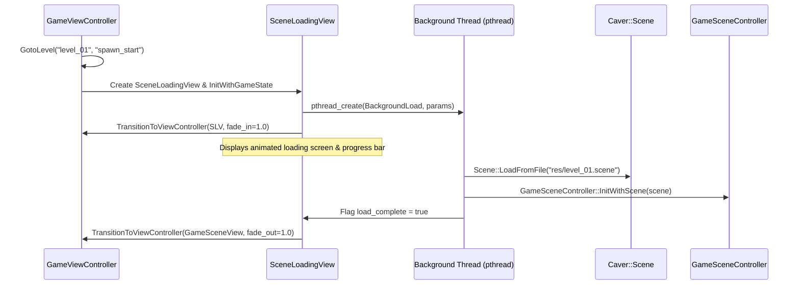

# Instant Scene Loading (Bypassing Loading Scene)

## Executive Summary
This document analyzes the scene loading pipeline in Swordigo to enable **Instant Scene Loading** (0-frame transition without the intermediate loading screen). It details how `SceneLoadingView`, `BackgroundLoad`, `Scene::LoadFromFile`, and `GameSceneController::InitWithScene` operate, and provides three distinct technical methods to bypass the loading screen completely.

---

## 1. Traditional Scene Loading Pipeline (Standard 2-Phase Async)



During standard operation, `SceneLoadingView` creates a background POSIX thread via `pthread_create` (`0x35303C` in ARM64) to unpack POD models, parse `.scene` protobuf binaries, and instantiate entities. The UI thread spins at 60 FPS rendering loading animations until `load_complete` becomes non-zero.

---

## 2. Technical Methods for Instant Scene Loading

### Technique 1: Hooking `SceneLoadingView::Update` (Instant Progress Short-Circuit)
Instead of altering the object lifecycle, hook `SceneLoadingView::Update(float dt)` (`0x0043650C` ARM64 / `0x00201BE0` ARM32). When `Update` is called:
1. Force the background thread to run synchronously to completion immediately: `pthread_join` or executing `BackgroundLoad` synchronously on the main thread.
2. Set internal progress float at `SceneLoadingView + 0x48` to `1.0f`.
3. Set `load_complete` flag at `SceneLoadingView + 0x50` to `1`.
4. Trigger immediate transition to `GameSceneView` in frame 0.

```c
// SRE C Interception Hook for Instant Load
void sre_SceneLoadingView_Update(void* self, float dt) {
    // Force immediate completion on first update call
    float* progress = (float*)((char*)self + 0x48);
    int* is_complete = (int*)((char*)self + 0x50);

    *progress = 1.0f;
    *is_complete = 1;

    // Call original Update to let it fire the completion transition
    if (g_orig_SceneLoadingView_Update) {
        g_orig_SceneLoadingView_Update(self, dt);
    }
}
```

---

### Technique 2: Synchronous Direct Scene Instantiation (Pure Bypass)
Bypass `SceneLoadingView` completely by calling `Scene::LoadFromFile` and `GameSceneController::InitWithScene` directly in the main thread:

```cpp
void instant_load_scene(const std::string& level_name, const std::string& spawn_point) {
    GameViewController* gvc = get_active_gvc();
    GameState* gs = gvc->gameState;

    // 1. Resolve level file path ("res/" + level_name + ".scene")
    std::string scene_file_path = "res/" + level_name + ".scene";

    // 2. Load scene synchronously into memory
    boost::shared_ptr<Scene> new_scene(new Scene());
    bool load_ok = Scene::LoadFromFile(new_scene.get(), scene_file_path.c_str());
    if (!load_ok) return;

    // 3. Initialize GameSceneController with newly loaded scene
    GameSceneController* gsc = gvc->gameSceneController;
    gsc->InitWithScene(new_scene);

    // 4. Spawn hero entity at specified spawn point
    gsc->SpawnHeroAt(spawn_point);

    // 5. Update GameState active level pointers
    gs->current_level_name = level_name;

    // 6. Transition directly to GameSceneView (bypassing SceneLoadingView entirely)
    gvc->TransitionToViewController(gvc->gameSceneView, 0.0f, 0.0f, false);
}
```

---

### Technique 3: Assembly Patching of `GameViewController::GotoLevel`
Patch the ARM64 instructions inside `GameViewController::GotoLevel` (`0x00358A74`) to replace the `SceneLoadingView` instantiation with a direct call to `GameSceneView`:

```arm64
// Original Instruction at 0x00358A74 + offset:
// BL  _ZN5Caver16SceneLoadingViewC1Ev  ; Instantiates SceneLoadingView

// Patch Instruction:
// NOP or BL _ZN5Caver13GameSceneViewC1Ev ; Bypasses SceneLoadingView creation
```

---

## 3. Comparison of Instant Load Techniques

| Method | Implementation Complexity | Stability & Safety | Visual Result |
| :--- | :--- | :--- | :--- |
| **Technique 1: Update Hook** | Low | High (Preserves original destruction order) | Instant 0-frame load |
| **Technique 2: Direct Synchronous Load** | Medium | Very High (Clean control flow) | Seamless instant teleport |
| **Technique 3: Assembly Patching** | High | Medium | Instant load |
