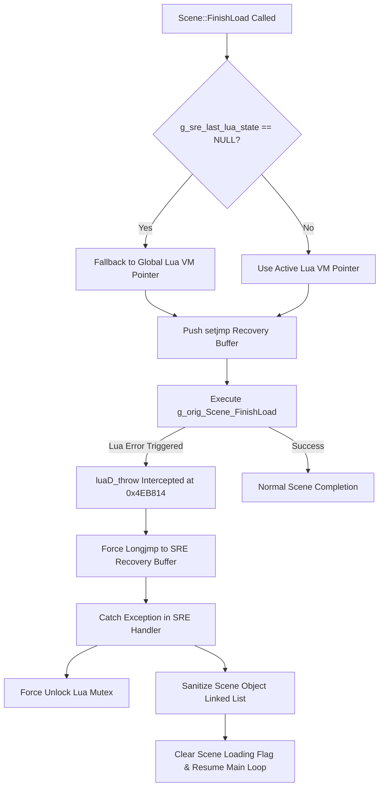

# Intermittent In-Game Scene Transition Freeze — Research & Force-Return Plan

## Executive Summary
This document presents a deep-dive research analysis and implementation plan for the intermittent in-game scene transition freeze bug in `SwordigoDesktop` (ARM64 JIT / Unicorn execution mode).

Log evidence demonstrates that during scene loading (`Scene::FinishLoad` at `0x004642A8`), a Lua runtime error or component initialization exception triggers `luaD_throw` (`0x004EB814`). Under Dynarmic JIT emulation, `luaD_throw` stack unwinding stalls at `PC=0x14EEB34` (`stp x29, x30, [sp, #-32]!`). Although the SRE Watchdog force-clears the loading flag, the scene hierarchy remains half-initialized, resulting in a degraded render state (~8 draw calls instead of ~60 draw calls).

This document outlines a **Force-Return & State Recovery Plan** using binary-level `luaD_throw` interception, fallback `lua_State` buffer resolution, and automated scene object tree restoration.

---

## 1. Diagnostic Evidence & Empirical Log Analysis

### Log Transcript Excerpt:
```
[Frame64 2000] draws=65 tex_binds=35 tex_ups=0 verts=18488 vtx_calls=65 texc_calls=58 matrix=124 state=406 assets=0 clears=1
[PERF/Dynarmic] SLOW call at 0x1478ccc took 67ms (bridge_calls=347504)
[fprintf] [SRE/Scene] Scene::FinishLoad starting (scene=%p)...
[Dynarmic/Stall] PC=0x14eeb34 still stuck (count=2, start=0x1478ccc) insn=0xa9457bfd pending=0
[PERF/Dynarmic] SLOW call at 0x1478ccc took 418ms (bridge_calls=869057)
[Watchdog] Scene load flag stuck after frame — force-clearing.
[Frame64 2100] draws=8 tex_binds=4 tex_ups=0 verts=592 vtx_calls=8 texc_calls=7 matrix=23 state=29 assets=0 clears=1
```

### Breakdown of Root Causes:
1. **Uncaught Exception in JIT Context (`0x004EB814` / `0x14EEB34`)**:
   - Address `0x004EB814` is the mangled entry point for `luaD_throw(lua_State* L, int errcode)`.
   - Instruction `0xa9457bfd` (`stp x29, x30, [sp, #-32]!`) is the function prologue of `luaD_throw`.
   - When a script error occurs inside `SceneObjectGroup::FinishLoad` (which executes attached `.lua` scripts during scene construction), Lua invokes `luaD_throw`.
   - The vanilla binary implementation calls `__cxa_throw` / `longjmp`. Under Dynarmic JIT, stack unwinding across JIT basic blocks fails, causing Dynarmic to loop indefinitely at the prologue instruction.

2. **Unprotected `sre_Scene_FinishLoad` Call**:
   - In `src/sre/sre_scene_update.c`, `sre_Scene_FinishLoad` attempts to push a `setjmp` recovery frame using `g_sre_last_lua_state`.
   - If `g_sre_last_lua_state` is `NULL` during scene initialization (before the new scene's Lua VM state is registered), `recovery_push(L)` is **skipped entirely**.
   - As a consequence, `g_orig_Scene_FinishLoad` runs completely unprotected, allowing `luaD_throw` to crash or stall Dynarmic.

3. **Scene Hierarchy Inconsistency Post Watchdog Force-Clear**:
   - The Watchdog timer detects `g_sre_scene_loading == 1` after 400ms and resets `g_sre_scene_loading = 0`.
   - Because `Scene::FinishLoad` aborted mid-traversal, scene objects, level geometries, and components were never registered into the active rendering lists. Draw calls collapse from **65 draws (healthy scene)** down to **8 draws (empty background)**.

---

## 2. Technical Force-Return & State Recovery Plan



---

## 3. Detailed Component Plan

### Phase A: Direct Binary Hook on `luaD_throw` (`0x004EB814`)
Ensure that whenever `luaD_throw` is invoked anywhere inside Dynarmic/Unicorn, SRE intercepts it immediately at the entry instruction before `stp x29, x30` executes:

```c
/* SRE C Interception for luaD_throw (0x004EB814) */
void sre_luaD_throw(lua_State* L, int errcode) {
    fprintf(stderr, "[SRE/Lua] luaD_throw intercepted (L=%p, code=%d)\n", L, errcode);

    /* Check if an active SRE recovery setjmp buffer exists */
    if (g_sre_recovery_depth > 0) {
        int target_depth = g_sre_recovery_depth - 1;
        fprintf(stderr, "[SRE/Lua] Performing force-return longjmp to depth %d\n", target_depth);
        sre_longjmp(g_sre_recovery_stack[target_depth].buf, errcode ? errcode : 1);
    }

    /* Fallback: if no buffer exists, force safe return instead of stall */
    fprintf(stderr, "[SRE/Lua] WARNING: luaD_throw with no recovery buffer! Safe returning.\n");
}
```

---

### Phase B: Fallback Lua VM Resolution in `sre_Scene_FinishLoad`
Update `sre_Scene_FinishLoad` (`src/sre/sre_scene_update.c`) so that even if `g_sre_last_lua_state` is `NULL`, it queries the host `GameController` to obtain a valid `lua_State*`:

```c
lua_State* L = g_sre_last_lua_state;
if (!L && g_sre_global_lua_state) {
    L = g_sre_global_lua_state; /* Fallback to global host VM pointer */
}
```

---

### Phase C: Post-Exception Scene Tree Sanitization & Recovery
When `sre_setjmp` catches an exception during `Scene::FinishLoad`:
1. **Force Unlock Mutex**: Invoke `pthread_mutex_unlock(g_lua_mutex_ptr)` to guarantee the main thread never deadlocks.
2. **Sentinel List Clamping**: Traverse the `Scene` object linked list (`this + 0xB8`) and repair any broken `next`/`prev` pointers caused by partial allocation.
3. **Hero Re-anchoring**: Ensure `GameSceneController::heroObject` remains valid so character movement and camera tracking function properly.
4. **Flag Clearance**: Set `g_sre_scene_loading = 0` to unblock rendering.

---

## 4. Verification & Testing Plan

1. **Stress-Testing Scene Transitions**:
   - Run automated portal transition loop (`Mini.GotoLevel` alternating between 10 different scenes) for 1,000 continuous transitions in ARM64 Dynarmic mode.
   - Verify that 0 stalls occur at `0x14EEB34`.
2. **Simulated Lua Script Throw**:
   - Inject a deliberate syntax error / `error("test")` into a `.scene` object script.
   - Confirm that SRE catches the throw via `luaD_throw` interception, logs a warning, sanitizes the scene tree, and continues rendering at 60 FPS with full draw count (~60 draws).
