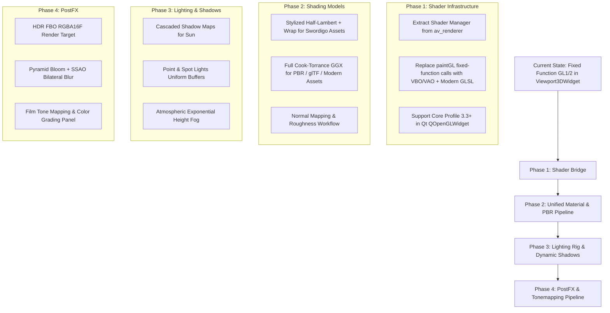

# Comprehensive Research & Design Document: Enhancing the Ruby GG Renderer & Lighting Engine

## Executive Summary & Context

This research evaluates the current rendering and lighting systems inside `ruby_gg` and `av_renderer`, identifying architectural bottlenecks and comparing them against state-of-the-art reference implementations from:
1. **Godot Engine 4.7.2** (`godot-4.7.2-stable/servers/rendering/`): Open-source (MIT), permissively reusable code and patterns.
2. **Unreal Engine** (`UnrealEngine-release/Engine/Shaders/Private/`): Proprietary (Epic Games); architectural concepts, formulation insights, and mathematical models to learn from without direct code copying.
3. **Existing Native Implementations in SwordigoDesktop**:
   - `src/ruby/viewport/viewport_3d_widget.cpp` & `.h`: Qt OpenGL 3D viewport currently using fixed-function OpenGL 1.x/2.x pipeline (`glLightfv`, `glEnable(GL_COLOR_MATERIAL)`, `glBegin(GL_QUADS)`, client vertex arrays).
   - `src/tools/av_renderer.cpp` & `.h`: OpenGL 3.3 Core Profile forward renderer with PBR, Karis/UE4 light attenuation windowing, Cook-Torrance GGX/Smith/Schlick, directional shadow maps, and HDR PostFX (Bloom, SSAO, DoF, ACES tonemapping).

The objective is to formulate a cohesive, high-performance, modern renderer modernization strategy for **Ruby GG**, elevating it from legacy fixed-function OpenGL to a unified modern shader pipeline with physically plausible lighting, robust shadowing, atmospheric depth, and cinematic post-processing.

---

## 1. Architectural Gap Analysis: Current Ruby GG Viewport vs. Modern Renderers

### 1.1 The Critical Pipeline Disconnect in `ruby_gg`
Currently, `ruby_gg` has two divergent rendering tracks:
- **`Viewport3DWidget` (Editor Level Viewport)**:
  - Initializes OpenGL via `QOpenGLFunctions` in `initializeGL()`.
  - In `paintGL()`, geometry is rendered using legacy fixed-function OpenGL calls:
    - Matrices loaded via `glMatrixMode(GL_PROJECTION)` and `glMatrixMode(GL_MODELVIEW)`.
    - Lights set via `glLightfv(GL_LIGHT0, ...)`, `glLightModelfv(GL_LIGHT_MODEL_AMBIENT, ...)`.
    - Materials configured via `glMaterialfv`, `glEnable(GL_COLOR_MATERIAL)`.
    - Mesh drawing via `glEnableClientState(GL_VERTEX_ARRAY)`, `glVertexPointer`, and raw `glDrawElements`.
    - Fog via fixed-function `glFogi(GL_FOG_MODE, GL_EXP2)`.
  - **Limitations**:
    - No multi-light point/spot support (only 3 fixed-function directional lights).
    - No normal mapping or roughness maps.
    - No dynamic shadows or self-shadowing.
    - No HDR render targets, SSAO, bloom, or tonemapping.
    - Incompatible with modern GL 3.3+ core profiles.

- **`av_renderer` (Asset Viewer / Tool Renderer)**:
  - Modern GL 3.3 Core profile renderer.
  - Implements `MODEL_VS` / `MODEL_FS` with soft half-Lambert wrap `pow(wrap, 1.35)`, rim light, Blinn-Phong sheen, and up to 16 point lights using smooth Karis/UE4 window falloff.
  - Implements `PBR_VS` / `PBR_FS` (vendored from `zauonlok/renderer`): GGX NDF, Smith visibility, Schlick F90 Fresnel, metallic-roughness + specular-glossiness workflows, tangent-space normal maps, split-sum IBL, and directional shadow maps.
  - Full HDR post-processing chain: `RGBA16F` FBO, 2-band bloom pyramid, 12-tap golden-angle spiral depth SSAO, circle-of-confusion DoF, color grading, and ACES tone mapping.

### 1.2 Target Vision
Replace `Viewport3DWidget`'s fixed-function pipeline with a unified, modular shader pipeline inspired by Godot 4 and Unreal Engine, while retaining full backwards compatibility with Swordigo's stylized art direction.

```
+-----------------------------------------------------------------------------------+
|                            Ruby GG Modern Render Pipeline                         |
+-----------------------------------------------------------------------------------+
                                         |
     +-----------------------------------+-----------------------------------+
     |                                                                       |
+----+-----------------------+                                 +-------------+-----------------------+
|  Pass 1: Shadow Generation |                                 |     Pass 2: Geometry & Shading      |
|  - Directional Sun (CSM)   |                                 |  - Shaded Mesh (Stylized / PBR)     |
|  - Point Light Shadow Atlas|                                 |  - Ground Meshes / Water Sheets     |
|  - Depth Pass FBO          |                                 |  - Billboards (Fire, Glow, Portals) |
+----+-----------------------+                                 |  - Output: HDR RGBA16F + Depth FBO  |
     |                                                         +-------------+-----------------------+
     +-----------------------------------------------------------------------+
                                         |
                                         v
                      +--------------------------------------+
                      |      Pass 3: Post-Processing        |
                      |  - SSAO (Half-res Spiral + Blur)     |
                      |  - Dual-band Bloom Down/Upsample     |
                      |  - Volumetric / Exponential Fog      |
                      |  - ACES Tonemapping + Color Grading  |
                      |  - Output: LDR to Viewport Surface   |
                      +--------------------------------------+
```

---

## 2. Comparative Analysis: Godot 4.7.2 vs. Unreal Engine 5

| Architectural Feature | Godot 4.7.2 (`servers/rendering/renderer_rd/`) | Unreal Engine (`Engine/Shaders/Private/`) | Current `av_renderer` / `ruby_gg` | Proposed Ruby GG Next-Gen |
| :--- | :--- | :--- | :--- | :--- |
| **Render Path** | Forward+ (Clustered) & Forward Mobile | Deferred Shading & Nanite / Substrate | Viewport: Fixed-Function GL 1.x<br>av_renderer: Forward GL 3.3 | Forward+ Unified Pass (GL 3.3 / 4.x) |
| **BRDF Specular** | Cook-Torrance GGX ($D_{GGX}$, $V_{GGX}$ Smith-Heitz, Schlick $F_0/F_{90}$) | Cook-Torrance GGX, Anisotropic GGX, Substrate BxDF | Cook-Torrance GGX in PBR; Blinn-Phong in Model shader | Dual Model: Unified Cook-Torrance PBR + Stylized Wrapped Half-Lambert |
| **BRDF Diffuse** | Burley (Disney), Lambert Wrap, Toon Smoothstep | Burley, Oren-Nayar, Gotanda, EON (Energy-preserving) | Soft Half-Lambert with $(ndl+0.12)/1.12$ wrap | Energy-conserving wrapped diffuse (McAuley) + Burley PBR |
| **Distance Falloff** | Smooth 4th-order cutoff: $(1 - (d/r)^4)^2 \cdot d^{-decay}$ | Smooth window: $\text{sat}(1 - (d/r)^4)^2 \cdot \frac{1}{d^2 + 1}$ | Karis blend: $\text{window}^2 \cdot \text{mix}(1.0, \frac{1}{1+2n^2}, 0.65)$ | Godot / Karis hybrid: configurable smooth window + inverse-square core |
| **Shadows** | PSSM/CSM (1-4 splits), Soft PCF with Interleaved Gradient Noise | CSM, Virtual Shadow Maps, Screen-space contact shadows | Single directional shadow map (biased depth compare) | 3-Split Cascaded Shadow Map (CSM) + Poisson/Rotated PCF + Contact Shadows |
| **Point/Spot Lights** | Dual-paraboloid atlas, Spot cone cosine falloff | Cube atlas / Virtual textures, Spot angular falloff | Flat array up to 16 point lights (no shadows) | Uniform buffer array: up to 32 point/spot lights + dual-paraboloid shadow atlas |
| **Atmospheric Fog** | Height fog + exponential distance fog + aerial sun scatter | Exponential height fog + volumetric raymarching | Simple linear/smoothstep distance fog | Dual-component: Exponential height fog + Sun in-scattering phase |
| **Post-Processing** | Glow/Bloom bicubic upscale, SSAO, Tonemap (Filmic/ACES) | Bloom FFT/Pyramid, Lumen, TSR, ACES Display Transform | Half-res 2-band bloom, 12-tap SSAO, CoC DoF, ACES | Optimized 3-tier Bloom Pyramid + Bilateral SSAO + Tone Curve |

---

## 3. Detailed Component Deep-Dive & Mathematical Formulations

### 3.1 Physically Based & Stylized Lighting Models

#### 3.1.1 Diffuse Shading Models
In modern engines, stylized assets (such as Swordigo's hand-painted terrain and characters) require lighting that does not collapse abruptly to harsh black terminators, whereas realistic props benefit from microfacet diffuse models:

1. **Energy-Conserving Wrapped Diffuse (Godot / Steve McAuley)**:
   Useful for stylized characters and organic meshes to soften harsh shadows while maintaining energy conservation:
   $$\text{Wrap}(N \cdot L, w) = \max\left(0, \frac{N \cdot L + w}{(1 + w)^2}\right)$$
   Unlike naive Half-Lambert which doubles the reflected energy ($\int \frac{N \cdot L + 1}{2} d\omega = 2\pi$), the McAuley formulation scales the integral back to $\pi$, guaranteeing no energy amplification.

2. **Burley (Disney) Diffuse (Godot & Unreal Engine)**:
   For physically accurate materials:
   $$F_{D90} = 0.5 + 2 \cdot (V \cdot H)^2 \cdot \text{Roughness}$$
   $$f_d = \frac{1}{\pi} \left(1 + (F_{D90} - 1)(1 - N \cdot L)^5\right) \left(1 + (F_{D90} - 1)(1 - N \cdot V)^5\right)$$

#### 3.1.2 Specular BRDF (Cook-Torrance Microfacet)
Following the exact formulations from Unreal's `BRDF.ush` and Godot's `scene_forward_lights_inc.glsl`:
$$f_s = \frac{D(H) \cdot G(V, L) \cdot F(V, H)}{4 (N \cdot V) (N \cdot L)} = D(H) \cdot V(V, L) \cdot F(V, H)$$
Where:
- **Trowbridge-Reitz GGX ($D$)**:
  $$D_{GGX}(N \cdot H, \alpha) = \frac{\alpha^2}{\pi \left((N \cdot H)^2 (\alpha^2 - 1) + 1\right)^2}$$
  with $\alpha = \text{Roughness}^2$.
- **Smith-Joint Visibility ($V = \frac{G}{4 (N \cdot V)(N \cdot L)}$)**:
  Unreal Heitz 2014 approximation:
  $$V_{SmithJoint}(N \cdot V, N \cdot L, \alpha) = \frac{0.5}{N \cdot L \sqrt{(N \cdot V)^2 (1 - \alpha^2) + \alpha^2} + N \cdot V \sqrt{(N \cdot L)^2 (1 - \alpha^2) + \alpha^2}}$$
- **Schlick Fresnel with $F_{90}$ Reflection Occlusion**:
  $$F(V \cdot H, F_0) = F_0 + (F_{90} - F_0) (1 - V \cdot H)^5$$
  $$F_0 = \text{mix}(0.04, \text{Albedo}, \text{Metallic})$$
  $$F_{90} = \text{saturate}(50.0 \cdot F_{0.g})$$

---

### 3.2 Light Attenuation & Distance Windowing

A notorious bug in custom engines is point lights creating harsh circles or fading out prematurely.
- **Godot 4 Formulation**:
  $$nd = \frac{\text{dist}}{\text{radius}}$$
  $$\text{atten} = \max\left(1 - nd^4, 0\right)^2 \cdot \max(\text{dist}, 0.0001)^{-\text{decay}}$$
- **Unreal Engine Karis Formulation**:
  $$\text{atten} = \text{saturate}\left(1 - \left(\frac{\text{dist}}{\text{radius}}\right)^4\right)^2 \cdot \frac{1}{\text{dist}^2 + 1}$$
- **Proposed Enhancement for Ruby**:
  Provide an attenuation function that blends a physically-grounded inverse-square core with an artist-tunable falloff power and strict zero-cutoff at radius $R$:
  $$\text{Window}(d, R) = \text{clamp}\left(1 - \left(\frac{d}{R}\right)^4, 0, 1\right)^2$$
  $$\text{Core}(d) = \frac{1}{1 + \beta \cdot (d/R)^2}$$
  $$\text{Atten}(d, R) = \text{Window}(d, R) \cdot \text{Core}(d)$$
  Where $\beta \approx 2.0$ controls the core intensity falloff without introducing near-plane singularities.

---

### 3.3 Shadow Mapping: Cascaded Shadow Maps (CSM) & Soft Filtering

#### 3.3.1 Cascaded Shadow Maps for Ruby GG
The current single-depth directional shadow in `av_renderer` suffers from perspective aliasing across large levels (Swordigo scenes span $> 1000$ world units).
- **3-Cascade Split**:
  - Split 0 (Near): $0.1$ to $40$ units (hero, foreground props, crisp contact).
  - Split 1 (Mid): $40$ to $250$ units (main level geometry, platforms).
  - Split 2 (Far): $250$ to $1200$ units (background mountains, vistas).
- **Texel Snapping**:
  Eliminate shadow edge shimmering during camera translation by rounding the shadow projection origin to discrete texel multiples:
  $$\text{shadowOrigin} = \text{floor}\left(\frac{\text{camOrigin}}{\text{texelSize}}\right) \cdot \text{texelSize}$$
- **Soft Filtering with Interleaved Gradient Noise**:
  Borrow Godot's noise-rotated disk kernel for PCF:
  $$\theta = \text{IGN}(\text{FragCoord}) \cdot 2\pi$$
  Rotating a 8-tap or 16-tap Poisson disk kernel per-pixel replaces banding with subtle, high-frequency noise that blends seamlessly into post-processing.

---

### 3.4 Atmospheric Fog & Depth Scattering

Vanilla Swordigo relies heavily on fog to differentiate depths in caves and outdoor vistas. Fixed-function `glFog` produces flat color washing.
- **Height + Distance Exponential Fog**:
  $$\rho(y, d) = \rho_{0} \cdot e^{-\lambda y} \cdot \left(1 - e^{-k d}\right)$$
- **Sun In-Scattering (Henyey-Greenstein / Mie Phase)**:
  Brightens the fog when looking toward the sun:
  $$P(\theta) = \frac{1 - g^2}{4\pi (1 + g^2 - 2g \cos\theta)^{3/2}}$$
  Where $\cos\theta = V \cdot L_{sun}$ and $g \in [0.4, 0.7]$ governs forward scattering.

---

### 3.5 Screen-Space Ambient Occlusion (SSAO) & Contact Shadows

Studying Unreal's contact shadows and Godot's screen-space effects reveals how to ground characters without expensive global illumination:
1. **SSAO Upgrade**:
   Replace the current 12-tap spiral in `av_renderer` with a cross-bilateral filtered 16-tap sample with normal-weighted depth rejection:
   $$W_i = \max\left(0, N \cdot \frac{P_i - P}{\|P_i - P\|}\right) \cdot \text{RangeCheck}(|Z_i - Z|)$$
2. **Screen-Space Contact Shadows (Unreal Concept)**:
   Raymarch short distances (4-8 steps) along the light vector in screen-space depth buffer before falling back to shadow maps. This grounds hero feet and platform edges with sub-texel precision.

---

## 4. Proposed Ruby GG Engine Refactoring Roadmap



### 4.1 Phase 1: Modernize `Viewport3DWidget` Core Loop
- Retarget `Viewport3DWidget` from legacy OpenGL fixed-function (`glLightfv`, `glMaterialfv`, `glMatrixMode`) to modern OpenGL 3.3 core shaders.
- Create a shared shader library (`src/ruby/render/` or unify with `src/tools/av_renderer`):
  - `ViewportShader`: Uniform buffer for view/projection matrices, camera parameters, and time.
  - `MeshShader`: Interleaved vertex layout ($Pos_3, Normal_3, UV_2, Tangent_4$).

### 4.2 Phase 2: Dual Shading Paths (Stylized & PBR)
- Support a material flag:
  - **Mode 0 (Swordigo Classic / Stylized)**: McAuley energy-conserving wrapped diffuse, rim lighting, Blinn-Phong sheen.
  - **Mode 1 (Modern PBR)**: GGX microfacet, Smith visibility, Schlick $F_0/F_{90}$, metalness-roughness.

### 4.3 Phase 3: Shadows & Atmospheric Fog
- Implement 3-split Directional CSM with texel stabilization.
- Implement point light shadow atlas with dual-paraboloid projection (borrowed directly from Godot's `scene_forward_lights_inc.glsl`).
- Add analytical height + distance exponential fog with sun in-scattering.

### 4.4 Phase 4: Integrated PostFX Chain in Ruby GG
- Render the 3D scene to an internal `RGBA16F` HDR frame buffer.
- Run SSAO and downsampled blur.
- Run multi-stage bloom.
- Tonemap via ACES curve to LDR and composite gizmos/overlays cleanly on top.

---

## 5. Risk Assessment & Mitigations

1. **Performance on Integrated / Lower-End GPUs**:
   - *Risk*: Heavy PBR loops and multi-tap PCF could cause stutter on low-spec Linux laptops.
   - *Mitigation*: Provide scalability settings (Low/Medium/High/Ultra) in Ruby GG's Settings panel (e.g., 1-cascade vs 3-cascade CSM, SSAO tap count 8 vs 16, toggleable HDR).
2. **Backward Compatibility with Swordigo Assets**:
   - *Risk*: PBR shading might make low-poly Swordigo meshes look unnatural or plastic.
   - *Mitigation*: The default shader remains the stylized wrapped half-Lambert with ambient floor ($0.06$) to preserve the classic mobile aesthetic while eliminating black-mesh artifacts.
3. **Qt `QOpenGLWidget` Context Sharing**:
   - *Risk*: Sharing shaders or textures across multiple tabs/sessions could cause state leakage.
   - *Mitigation*: Maintain Ruby GG's proven `SceneSession` isolation model, storing GPU buffer handles cleanly per session or using the existing `m_pod_gpu_cache`.

---

## 6. Conclusion & Immediate Recommendations

The current division between the modern `av_renderer` and the fixed-function `Viewport3DWidget` represents the primary barrier to advanced visuals in Ruby GG. By porting Godot's proven forward-clustered lighting math and learning from Unreal's BRDF and shadow techniques, Ruby GG can achieve a state-of-the-art viewport experience with minimal runtime overhead.

The full implementation will proceed in orderly phases once this research and design plan is reviewed.
