# Feasibility Report: Video Background System Optimization

## 1. The Problem
Currently, the video background engine (`src/platform/video_background.cpp`) extracts **all frames** of a companion `.mp4` video to temporary PNG files synchronously during texture registration:
```cpp
int ret = std::system(cmd.c_str()); // Blocks main thread until all frames are extracted
```
Because texture registration happens on the main thread during level/scene transitions, the game freezes and waits for the entire FFmpeg process to complete. For a standard 10-second video at 30 FPS (300 frames), this block can take anywhere from **2 to 8 seconds** depending on the CPU, causing a major loading lag.

---

## 2. The Proposed Solution (The "First-Frame First" Approach)
1. **Stage 1 (Synchronous / Instant)**: Extract only the **first frame** (or fall back to the vanilla static background texture) and upload it to the GPU buffer immediately.
2. **Stage 2 (Asynchronous / Background)**: Launch a background worker thread (`std::thread`) to extract the remaining frames.
3. **Stage 3 (Fallback Playback)**: During the extraction, keep the background rendering frozen on the first frame. Once the thread signals that all frames are ready, resume normal 0.4x speed video playback.

---

## 3. Technical Feasibility Analysis

We analyzed three potential implementation strategies for this design:

### Option A: Shell-Based Two-Stage Extraction (Recommended for simplicity & low risk)
We keep using the external `ffmpeg` binary but split it into two commands:
1. **Sync Command**: Extract only frame 1.
   ```bash
   ffmpeg -y -i input.mp4 -vf "[filters]" -vframes 1 frame_0001.png
   ```
   *Execution time: ~50ms (virtually instant).*
2. **Async Command**: Spin up a C++ background thread to execute the rest.
   ```bash
   ffmpeg -y -i input.mp4 -vf "[filters]" -ss 0.033 -r 30 frame_%04d.png
   ```
   *Note: We offset by 1 frame (`-ss 0.033`) or overwrite starting at frame 2.*

* **Feasibility**: High. It requires minimal changes to the existing file structure and doesn't introduce external library dependencies.
* **CPU/Multithreading**: FFmpeg handles multicore scaling natively via its `-threads` option.

### Option B: On-the-Fly FFmpeg Decode Integration (Ideal for pure performance)
Instead of invoking the CLI and writing PNG files to `/tmp` (which causes heavy disk I/O), we integrate the FFmpeg libraries (`libavcodec`, `libavformat`, `libswscale`) directly into our codebase.
1. The main thread opens the video file, decodes the first frame in memory, and uploads it.
2. An asynchronous worker thread reads, decodes, and queues the next few frames into a thread-safe ring buffer of raw pixels.
3. The main thread pops frames from the queue and uploads them to the GPU.

* **Feasibility**: Medium-Low. It requires linking against `libavcodec`, `libavformat`, and `libswscale` in the `Makefile`, which might complicate compilation for users without developer packages installed.
* **Disk I/O**: Reduces write wear and loading times to zero.

### Option C: Threaded Native PNG-based Batcher (Simplest threading)
We launch a single background thread that calls the original single FFmpeg command. Meanwhile, `update_texture_maybe` checks how many frames have been written to `/tmp` so far.
1. Start `ffmpeg` in a background thread.
2. As frames are generated (`frame_0001.png`, `frame_0002.png`, etc.), `update_texture_maybe` plays whatever frames are currently present.
3. If the playback index exceeds the currently generated count, it clamps/freezes to the last available frame until the worker thread exits.

* **Feasibility**: High.
* **Risk**: High risk of race conditions or reading half-written PNG files if the game reads a frame while FFmpeg is still writing/flushing it.

---

## 4. Proposed Architecture (Option A)

```mermaid
sequenceDiagram
    participant Main as Game Main Thread
    participant Worker as Async Worker Thread
    participant Disk as Temporary Disk (/tmp)

    Main->>Disk: 1. Extract first frame (ffmpeg -vframes 1)
    Disk-->>Main: First frame ready
    Main->>Main: 2. Upload frame 1 to GPU
    Main->>Worker: 3. Spawn background thread
    Note over Main: Game starts loading/rendering immediately (Frozen on Frame 1)
    
    rect rgb(30, 40, 50)
        Note over Worker: Background Extraction Loop
        Worker->>Disk: ffmpeg -y -i video.mp4 -r 30 frame_%04d.png
        Disk-->>Worker: Writing frames...
        Worker->>Worker: Signal extraction_complete = true
    end

    loop Every frame update_texture_maybe()
        alt extraction_complete == false
            Main->>Main: Display Frame 1
        else extraction_complete == true
            Main->>Disk: Read frame_idx.png
            Main->>Main: Display scrolling video background
        end
    end
```



### Thread Safety Concerns:
To implement this safely in C++, we must guard the player state against race conditions:
1. **State Flags**: Use `std::atomic<bool> extraction_complete` and `std::atomic<bool> is_extracting` inside `PlayerState`.
2. **Worker Lifetime**: The worker thread must be joinable or detached. If the texture is destroyed or the level is changed *while* the worker is still extracting, we must signal a cancel request (via a cancel flag or process kill) to prevent writes to a deleted directory.
3. **Clean Termination**: Ensure `cleanup()` joins or terminates any active background thread processes.

---

## 5. Next Steps
Would you like to proceed with **Option A (Shell-based split)**? It provides the best balance between ease of implementation, safety, and eliminating loading stutter.
Please let me know your thoughts or feedback on this plan!
