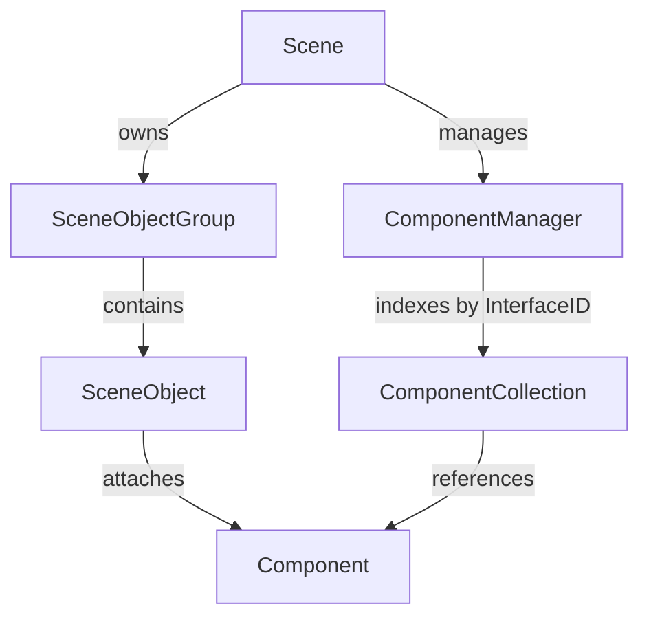

# Swordigo Caver Engine: Architecture & Systems Specification

## 1. System Overview
The **Caver Engine** is Touch Foo's proprietary 2.5D C++ game engine created for *Swordigo*. It integrates a custom Entity-Component-System (ECS) architecture, hardware-accelerated OpenGL ES fixed-function / programmable rendering pipelines, an impulse-based 2D/3D collision response simulator, coroutine-driven embedded Lua 5.1 scripting, and a hierarchical scene graph serialized via Google Protocol Buffers (under the FileRift `.scl`, `.scene`, and `.gdata` asset formats).

---

## 2. ECS Core Architecture

### 2.1 Object Model
- **`Caver::Scene`**: Root singleton representing the active game world level. Controls the simulation tick loop, rendering pipeline, viewport camera, and scene-level Lua context (`ProgramState`).
- **`Caver::SceneObject`**: The fundamental entity representation in the game world. Contains:
  - `m_identifier` (`std::string`): Unique entity name used for scene lookups (e.g. `"hero"`, `"boss_phase2"`, `"door_forest"`).
  - `m_transform` (`Caver::Transform`): Spatial translation (`Vector3`), rotation (`Quaternion` / Euler angles), scale factor, and origin offset.
  - `m_velocity` (`Caver::Vector3`): Linear kinetic motion vector.
  - `m_active` (`bool`): Determines whether the entity participates in simulation and rendering updates.
  - `m_hidden` (`bool`): Visibility toggle.
  - `m_components` (`std::vector<Component*>`): Ordered list of attached functionality components.
- **`Caver::Component`**: Abstract polymorphic base class for all entity behaviors and attributes.
  - Identification: Each component class exposes a static string identifier `ClassName()` and a unique numerical type hash `InterfaceID()`.
  - Lifecycle Callbacks:
    - `InitWithComponent(const Proto::Component&)`: Deserializes properties from binary/text FileRift protobuf stream.
    - `Prepare()`: Resolves inter-component dependencies and registers Lua function tables with `ProgramState`.
    - `Update(float dt)`: Executes per-frame logic, physics integration, and animation interpolation.
    - `Draw(RenderingContext* ctx, const Matrix4& mvp, bool wireframe)`: Emits render commands to the graphics pipeline.
    - `Dealloc()`: Cleans up native allocations, texture references, and physics collision fixtures.

### 2.2 Component Management & Spatial Indexing
- **`Caver::ComponentManager`**: Maintains global lookups for all live components categorized by `InterfaceID()`. Uses `ComponentCollection` templates for amortized $O(1)$ batch iteration without dynamic casting overhead.
- **`Caver::SceneGrid`**: Uniform 2D spatial grid partitioning the level into discrete buckets. Accelerates frustum culling, dynamic light queries, and collision detection between mobile entities and static geometry.

---

## 3. Execution Cycle & Frame Loop

Each simulation step executes deterministically in the following sequential order:

1. **Input Processing**: Queries virtual touchscreen layout (`PhoneControlsLayout` / `PadControlsLayout`) and hardware controller buttons into directional axes, jump, swing, and magic cast events.
2. **Script Coroutine Resumption (`Caver::ProgramState`)**: Resumes pending Lua coroutines suspended by `Program.Wait(seconds)` whose elapsed timestamps have been reached.
3. **AI & Entity Control (`EntityControllerComponent`)**: Evaluates state transitions, pathing directions, target acquisition, and behavior trees (`"fight"`, `"patrol"`, `"none"`).
4. **Physics & Collision Integration (`PhysicsObjectComponent`, `CollisionShapeComponent`)**:
   - Computes linear velocities, gravity acceleration, and platform conveyor offsets.
   - Evaluates broadphase bounding boxes via `SceneGrid`.
   - Resolves narrowphase contact pairs against static geometry meshes (`GroundMeshComponent`) and dynamic collision volumes.
   - Dispatches collision events (`OnCollide`) to attached script blocks.
5. **Animation Blending (`AnimationControllerComponent`, `KeyframeAnimationComponent`)**:
   - Updates timeline playback, bone matrix hierarchies, and cross-fades between animation tracks (e.g. idle to run to attack).
6. **Transform Hierarchy Resolution**: Recomputes world matrices (`Caver::Matrix4`) from parent-child links (`ObjectLinkControllerComponent`).
7. **Camera Tracking (`Caver::Camera`)**: Evaluates target tracking offsets, smooth damping, deadzones, and rumble decay.
8. **Rendering Pipeline**:
   - Background layers: Parallax rendering of sky and distant scenery (`BackgroundComponent`, `RotatingBackgroundComponent`).
   - Static Terrain: Batched textured meshes (`GroundMeshComponent`, `GroundPolygonComponent`).
   - Dynamic Entities: Skinned character models (`ModelComponent`) and 2D billboards (`SpriteComponent`).
   - Combat FX & Lighting: Alpha-blended weapon trails (`WeaponTrailComponent`), point lights (`LightComponent`), and particle systems (`ParticleEmitterComponent`).
   - UI & Overlays: Floating damage numbers, text bubbles (`TextBubbleComponent`), and HUD elements.

---

## 4. Scripting Architecture & Lua 5.1 Runtime

- The engine embeds an unmodified **Lua 5.1** C runtime.
- **`Caver::ProgramState`** wraps the `lua_State*` environment, providing:
  - Sandboxed global scope per scene.
  - Automated garbage collection pacing.
  - Memory-safe userdata wrappers for native objects via `PushSceneObject`.
  - Non-blocking coroutine scheduler for asynchronous delays (`Program.Wait`).
- Event triggers (such as collision, destruction, interaction, or timer expiration) invoke compiled Lua functions passing `local self, target = ...;` as function arguments.
